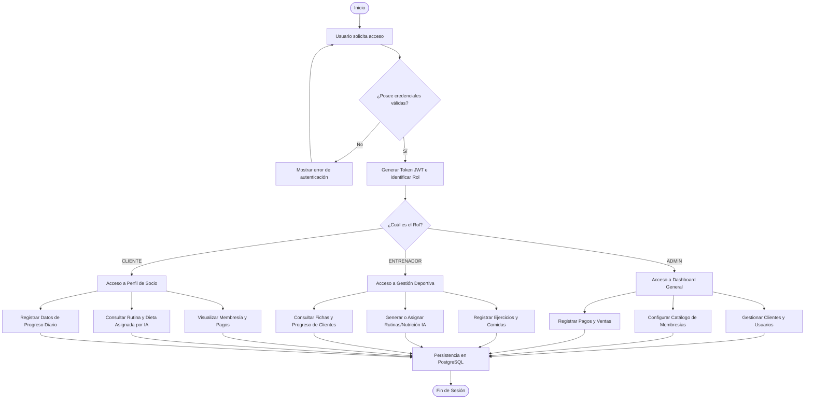

# Documento de Gobierno de Software e Inteligencia Artificial (Gobierno IA V3) - GleyforGym

Este documento detalla la estructura formal, los requerimientos, la arquitectura y el ciclo de vida del sistema **GleyforGym** para su integración en plantillas de Gobierno de Software e IA.

---

## 1. PROCESOS DE NEGOCIO (GleyforGym)

A continuación se detallan los procesos centrales del negocio del gimnasio gestionados por la plataforma.

| ID Proceso | Nombre del Proceso | Descripción | Actor Principal |
|---|---|---|---|
| **P01** | Autenticación y Control de Roles | Controla el acceso seguro al sistema por parte de administradores, entrenadores y clientes mediante JWT. | Todos los usuarios |
| **P02** | Gestión de Fichas de Clientes | Registro de información personal, datos médicos, objetivos y perfil biométrico del socio. | Administrador / Entrenador |
| **P03** | Ventas, Pagos y Membresías | Control de planes de suscripción, asignación de membresías y cobros periódicos. | Administrador |
| **P04** | Registro de Asistencia Diaria | Control y marcación del ingreso y salida física de los socios en el gimnasio. | Cliente |
| **P05** | Prescripción y Gestión de Ejercicios | Mantenimiento del catálogo de ejercicios clasificados por grupos musculares y enlaces multimedia. | Entrenador / Administrador |
| **P06** | Generación de Rutinas con IA | Creación asistida e inteligente de planes de entrenamiento adaptados al perfil del usuario. | Motor IA / Entrenador |
| **P07** | Generación de Nutrición con IA | Creación asistida e inteligente de planes alimenticios basados en el requerimiento energético y macronutrientes. | Motor IA / Entrenador |
| **P08** | Control de Progreso Físico | Registro periódico de medidas corporales y composición de grasa/masa magra del cliente. | Cliente / Entrenador |

---

## 2. ACTIVIDADES BPMN DETALLADAS

Desglose de las actividades específicas que conforman cada uno de los procesos del negocio.

### P01: Autenticación y Control de Roles
*   **Act01-1**: El usuario ingresa credenciales (correo y contraseña).
*   **Act01-2**: El sistema valida las credenciales y devuelve un token firmado con JWT.
*   **Act01-3**: El frontend almacena el token de forma segura en el almacenamiento local.
*   **Act01-4**: Los interceptores añaden el token de autorización en la cabecera de las solicitudes HTTP.
*   **Act01-5**: La pasarela de rutas restringe o habilita el acceso según el rol del token (ADMIN, ENTRENADOR, CLIENTE).

### P02: Gestión de Fichas de Clientes
*   **Act02-1**: Registro de datos primarios (DNI, nombres, apellidos, teléfono, fecha de nacimiento, sexo, dirección).
*   **Act02-2**: Carga de variables de entrenamiento (objetivo actual, nivel físico y restricciones médicas).
*   **Act02-3**: Creación del usuario asociado en la base de datos con rol CLIENTE.
*   **Act02-4**: Actualización de datos de perfil y estado de vigencia del cliente (Activo/Inactivo).

### P03: Ventas, Pagos y Membresías
*   **Act03-1**: Definición del catálogo de membresías (nombre, descripción, días de duración, precio, beneficios).
*   **Act03-2**: Asignación de una membresía a la ficha de un cliente con fecha de inicio y finalización.
*   **Act03-3**: Registro de pago del monto acordado (metodo_pago, monto, estado, observación).
*   **Act03-4**: Ejecución diaria de la tarea automática en el servidor que actualiza el estado de las membresías vencidas a `VENCIDA`.

### P04: Registro de Asistencia Diaria
*   **Act04-1**: El socio registra su ingreso en portería a través de la interfaz cliente.
*   **Act04-2**: El sistema valida que el socio posea una membresía con estado `ACTIVO`.
*   **Act04-3**: Registro de marca de hora de entrada en la tabla de asistencias.
*   **Act04-4**: Registro de hora de salida al finalizar el entrenamiento (manual o por sistema).

### P05: Prescripción y Gestión de Ejercicios
*   **Act05-1**: Configuración del catálogo de ejercicios disponibles en el gimnasio.
*   **Act05-2**: Clasificación del ejercicio por grupo muscular (Pecho, Espalda, Piernas, Hombros, Brazos, Core).
*   **Act05-3**: Vinculación de videos demostrativos almacenados en Cloudinary.

### P06: Generación de Rutinas con IA
*   **Act06-1**: Solicitud del entrenador o cliente para generar una rutina de entrenamiento.
*   **Act06-2**: Recopilación de variables de entrada del cliente: objetivo (e.g. Fuerza, Hipertrofia, Pérdida de grasa), nivel físico (e.g. Principiante, Intermedio, Avanzado) y restricciones médicas.
*   **Act06-3**: Consulta al motor de IA para procesar el algoritmo de recomendación adaptado.
*   **Act06-4**: Presentación de la rutina estructurada por días (ejercicio, series, repeticiones, descanso).

### P07: Generación de Nutrición con IA
*   **Act07-1**: Solicitud para generar un plan de alimentación.
*   **Act07-2**: Extracción de datos antropométricos del cliente (peso, estatura, edad, sexo, nivel de actividad física diaria).
*   **Act07-3**: Procesamiento en el motor de IA para estimar las calorías diarias de mantenimiento y la meta calórica.
*   **Act07-4**: Cálculo automático de macronutrientes (proteínas, carbohidratos, grasas).
*   **Act07-5**: Distribución de comidas sugeridas a partir del catálogo de alimentos.

### P08: Control de Progreso Físico
*   **Act08-1**: Registro manual o asistido del peso (kg), porcentaje de grasa (%) y porcentaje de masa magra (%).
*   **Act08-2**: Toma de medidas corporales específicas (brazos, pecho, cintura, piernas).
*   **Act08-3**: Procesamiento de los históricos del cliente.
*   **Act08-4**: Renderizado de curvas de evolución gráfica del estado físico.

---

## 3. FLUJO GENERAL DEL SISTEMA (BPMN Lógico)



---

## 4. REQUERIMIENTOS DEL SISTEMA

### Requerimientos Funcionales (RF)

| ID RF | Nombre del Requerimiento | Descripción | Prioridad |
|---|---|---|---|
| **RF01** | Autenticación Segura | El sistema debe permitir el inicio de sesión y validación de permisos mediante JWT. | Alta |
| **RF02** | Gestión de Clientes | El sistema debe permitir registrar, editar y desactivar clientes con DNI único. | Alta |
| **RF03** | Ficha Biométrica | El sistema debe almacenar peso, estatura, sexo, nivel, objetivo y restricciones médicas del socio. | Alta |
| **RF04** | Catálogo de Membresías | El sistema debe permitir configurar planes de membresía parametrizables. | Media |
| **RF05** | Asignación y Pagos | El sistema debe registrar pagos y vincular membresías activas a los perfiles de clientes. | Alta |
| **RF06** | Control de Vencimientos | El sistema debe actualizar de forma automática el estado de membresías expiradas a "VENCIDA". | Alta |
| **RF07** | Catálogo de Ejercicios | El sistema debe permitir clasificar ejercicios por grupo muscular y asociar enlaces de Cloudinary. | Media |
| **RF08** | Recomendador de Rutinas IA | El motor de IA debe generar planes de entrenamiento basados en objetivo, nivel y restricciones. | Alta |
| **RF09** | Recomendador de Nutrición IA | El motor de IA debe calcular las calorías de mantenimiento y generar planes de comidas acordes. | Alta |
| **RF10** | Registro de Progreso | El sistema debe registrar medidas corporales de brazo, pierna, cintura, pecho, grasa y masa magra. | Media |
| **RF11** | Control de Asistencias | El sistema debe permitir registrar ingresos y salidas físicas diarias de los socios. | Media |
| **RF12** | Panel de Estadísticas (KPIs) | El sistema debe mostrar gráficos e indicadores consolidados en un tablero interactivo. | Media |

### Requerimientos No Funcionales (RNF)

| ID RNF | Categoría | Descripción | Prioridad |
|---|---|---|---|
| **RNF01** | Rendimiento | La API del backend debe construirse en FastAPI para asegurar alta concurrencia y velocidad. | Alta |
| **RNF02** | Base de Datos | Se debe utilizar PostgreSQL como sistema de persistencia relacional administrado. | Alta |
| **RNF03** | Frontend Web | El portal web de administración debe ser desarrollado en React + Vite con estilos glassmorphism. | Alta |
| **RNF04** | Compatibilidad Móvil | La aplicación del cliente debe ser desarrollada en Flutter para soporte nativo Android y iOS. | Alta |
| **RNF05** | Almacenamiento CDN | Los videos e imágenes demostrativos de los ejercicios deben gestionarse vía Cloudinary CDN. | Media |
| **RNF06** | Seguridad de Datos | El almacenamiento de las contraseñas debe realizarse empleando algoritmos de hash seguros (bcrypt). | Alta |
| **RNF07** | Calidad de Software | La suite de pruebas debe mantener una cobertura superior al 90% (pytest/vitest). | Alta |

---

## 5. ARTEFACTOS DE SOFTWARE

Mapa de los principales módulos y archivos de código del ecosistema GleyforGym.

```
gleyforgym/
├── backend/
│   ├── app/
│   │   ├── main.py              # Inicialización de la API FastAPI y routers
│   │   ├── database.py          # Configuración del motor SQLAlchemy (PostgreSQL)
│   │   ├── models.py            # Esquema relacional de tablas (Usuario, Cliente, etc.)
│   │   ├── schemas.py           # Modelos de validación de entrada/salida (Pydantic)
│   │   ├── security.py          # Lógica de hashing de contraseñas y gestión de JWT
│   │   ├── constants.py         # Definición de mensajes de error y strings constantes
│   │   ├── config.py            # Lectura de variables de entorno (.env / Render settings)
│   │   └── routes/
│   │       ├── usuarios.py      # Autenticación, login y perfiles
│   │       ├── clientes.py      # Fichas biométricas y datos de contacto
│   │       ├── membresias.py    # Catálogo público y mantenimiento de planes
│   │       ├── pagos.py         # Control de ingresos de caja y comprobantes
│   │       ├── asistencias.py   # Registro de ingreso físico de socios
│   │       ├── progreso.py      # Historial de mediciones corporales
│   │       ├── ejercicios.py    # Listados multimedia de ejercicios
│   │       ├── rutinas.py       # Asignación de entrenamientos y motor de IA
│   │       └── nutricion.py     # Menús calóricos y dietas IA
│   ├── requirements.txt         # Listado de dependencias del backend Python
│   └── create_db.py             # Inicialización de la BD y siembra del usuario administrador
│
├── web-admin/
│   ├── package.json             # Dependencias npm y scripts del frontend (Vite/Vitest)
│   ├── vite.config.js           # Ajustes de empaquetado de la aplicación React SPA
│   ├── index.html               # Contenedor HTML base de la web
│   └── src/
│       ├── main.jsx             # Punto de entrada de renderización React
│       ├── App.jsx              # Enrutador e inyección de layouts
│       ├── index.css            # Estilos dark-luxury glassmorphic globales
│       ├── api/
│       │   └── api.js           # Cliente Axios con inyección de JWT y control de error 401
│       ├── components/
│       │   ├── Layout.jsx       # Estructura del portal y redirección de logout
│       │   └── ProtectedRoute.jsx# Control de visibilidad según roles de usuario
│       └── pages/
│           ├── Inicio.jsx       # Landing page corporativa pública de GleyforGym
│           ├── Login.jsx        # Pantalla de acceso premium
│           └── [Modulos].jsx    # Vistas de Clientes, Rutinas, Pagos, etc.
│
└── mobile-app/
    ├── pubspec.yaml             # Gestión de paquetes y assets Flutter
    └── lib/
        ├── main.dart            # Inicializador de la aplicación móvil
        ├── services/            # Clientes HTTP e integración de API
        └── screens/             # Vistas móviles de rutinas, comidas y perfil
```

---

## 6. CONTROL DE VERSIONES (Historial de Cambios)

| Versión | Fecha | Autor | Descripción de los Cambios |
|---|---|---|---|
| **v1.0.0** | 15/01/2026 | Keen Guerra | Configuración inicial del backend (FastAPI), modelos SQL base y CRUDs básicos de clientes, membresías y ejercicios. Base de datos SQLite. |
| **v1.1.0** | 12/02/2026 | Keen Guerra | Implementación de Login, hashing de contraseñas con bcrypt y generación de tokens JWT. Configuración de roles en el frontend y backend. |
| **v2.0.0** | 10/04/2026 | Keen Guerra | Desarrollo de motores de inteligencia artificial para generación de rutinas adaptativas y planes nutricionales personalizados. Conexión con Cloudinary CDN. |
| **v2.1.0** | 20/05/2026 | Keen Guerra | Rediseño estético total del frontend (`web-admin`) aplicando diseño visual "Dark Luxury Glassmorphic". Implementación de cobertura de pruebas unitarias al 96.43%. |
| **v3.0.0** | 15/06/2026 | Keen Guerra | **Versión Actual de Producción**. Despliegue en la nube mediante Render Blueprint (`render.yaml`). Migración exitosa de la base de datos a PostgreSQL. Reparación del bug de bucle de redirección en `/login` para permitir visitas públicas a la lista de membresías desde la página de inicio. |

---

## 7. DEPENDENCIAS ENTRE MÓDULOS

*   **Autenticación (JWT)**: Requerido de manera transversal por todos los módulos a nivel de API para verificar identidad (excepto la Landing Page pública en `web-admin` y la consulta del catálogo de membresías `GET /membresias/`).
*   **Usuarios & Clientes**: Relación 1:1. El módulo de clientes requiere la existencia de un registro de usuario asignado con rol `CLIENTE`.
*   **Membresías & Pagos**: El módulo de pagos requiere una relación activa hacia la asignación de membresía del cliente (`cliente-membresias`).
*   **Motor de Rutinas IA**: Depende directamente de la base de datos de **Ejercicios** (de donde extrae las actividades físicas) y de los datos biométricos de **Clientes** (edad, peso, objetivo, nivel y restricciones médicas).
*   **Motor de Nutrición IA**: Depende de la base de datos de **Comidas** y del perfil metabólico del **Cliente** (tasa de metabolismo basal estimada por estatura, peso, edad y sexo).

---

## 8. AI-DLC (Ciclo de Vida de la Inteligencia Artificial)

Detalle del ciclo de vida para los recomendadores inteligentes de rutinas y planes nutricionales.

```
       [ INTENCIÓN ] ──> Definición del problema: prescribir ejercicio y dietas sin riesgo de lesiones.
             │
             ▼
        [ DISEÑO ] ───> Arquitectura de reglas heurísticas + filtrado basado en el perfil del cliente.
             │
             ▼
      [ DESARROLLO ] ──> Programación en Python, endpoints '/rutinas/generar' y '/nutricion/generar'.
             │
             ▼
      [ VALIDACIÓN ] ──> Pruebas de seguridad con restricciones médicas críticas. Aprobación de entrenadores.
             │
             ▼
      [ DESPLIEGUE ] ──> Servicio web FastAPI desplegado en la nube de Render en entorno de producción.
```

1.  **Intención (Intent)**:
    *   *Objetivo*: Automatizar la creación de planes de entrenamiento y nutrición reduciendo el tiempo de trabajo de los entrenadores y ofreciendo una guía instantánea y personalizada a los socios.
    *   *Métrica de Éxito*: Disminución en 70% de tiempos de diseño de rutinas, sin incidencias o reporte de dolores/lesiones por rutinas mal asignadas.
2.  **Diseño (Design)**:
    *   *Datos*: Perfil biométrico del usuario, nivel actual autodeclarado, objetivo fitness de la ficha del socio, y restricciones médicas registradas.
    *   *Algoritmo*: Filtrado estructurado que elimina ejercicios de grupos musculares prohibidos por condiciones médicas y balancea el volumen de series y repeticiones según el nivel (Principiante/Intermedio/Avanzado).
3.  **Desarrollo (Development)**:
    *   *Implementación*: Módulo python integrado en la lógica de negocio del backend FastAPI, invocable mediante endpoints REST.
    *   *Integración*: Invocación asíncrona desde el panel del cliente en la aplicación web y móvil.
4.  **Validación (Validation)**:
    *   *Pruebas*: Verificación de seguridad (e.g. un cliente con lesión de rodilla no debe recibir sentadillas pesadas en su rutina). La cobertura de pruebas cubre casos de borde de restricciones médicas.
    *   *Certificación*: Los entrenadores del gimnasio evalúan una muestra de 100 rutinas generadas de forma aleatoria para validar coherencia metodológica.
5.  **Despliegue (Deployment)**:
    *   *Ejecución*: Desplegado en la nube de Render como parte del servicio web FastAPI.
    *   *Mantenimiento*: Actualizaciones constantes de la base de datos de ejercicios y alimentos basadas en el feedback de satisfacción del cliente.

---

## 9. INDICADORES DEL DASHBOARD (KPIs)

Definiciones operativas listas para ser cargadas en celdas de plantillas de control.

*   **Clientes Activos**:
    *   *Fórmula*: `Count(clientes) WHERE estado = 'ACTIVO' AND fecha_fin_membresia >= hoy()`
    *   *Propósito*: Medir la retención mensual del gimnasio.
*   **Recaudación por Pagos**:
    *   *Fórmula*: `Sum(pagos.monto) WHERE pagos.estado = 'COMPLETADO' AND pagos.fecha >= primer_dia_mes_actual()`
    *   *Propósito*: Control de flujo de caja mensual del negocio.
*   **Rutinas Generadas por IA**:
    *   *Fórmula*: `Count(rutinas) WHERE creado_por_ia = TRUE`
    *   *Propósito*: Conocer el nivel de uso del motor de inteligencia artificial por parte de los socios y entrenadores.
*   **Progreso Promedio**:
    *   *Fórmula*: `Average(progreso.porcentaje_grasa_diferencia) WHERE progreso.fecha >= hace_30_dias()`
    *   *Propósito*: Monitorear la efectividad real de las rutinas e incentivar la fidelidad del cliente midiendo su mejora de salud.
