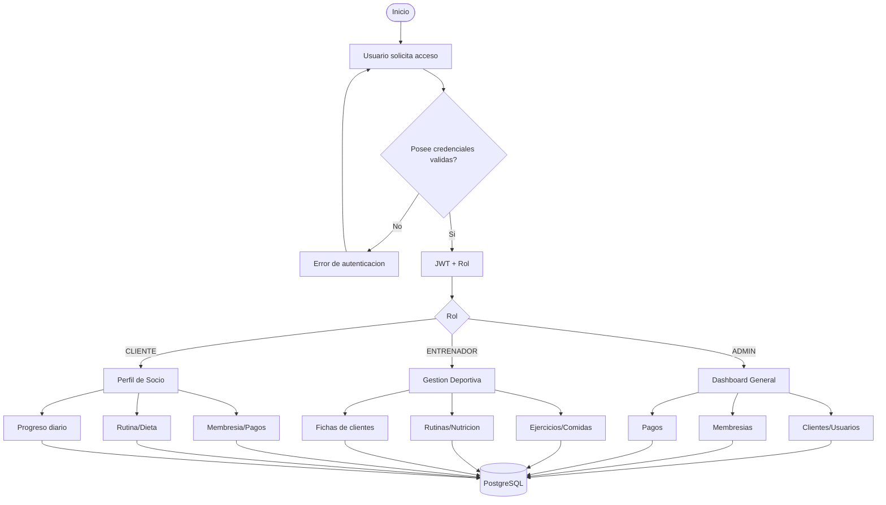
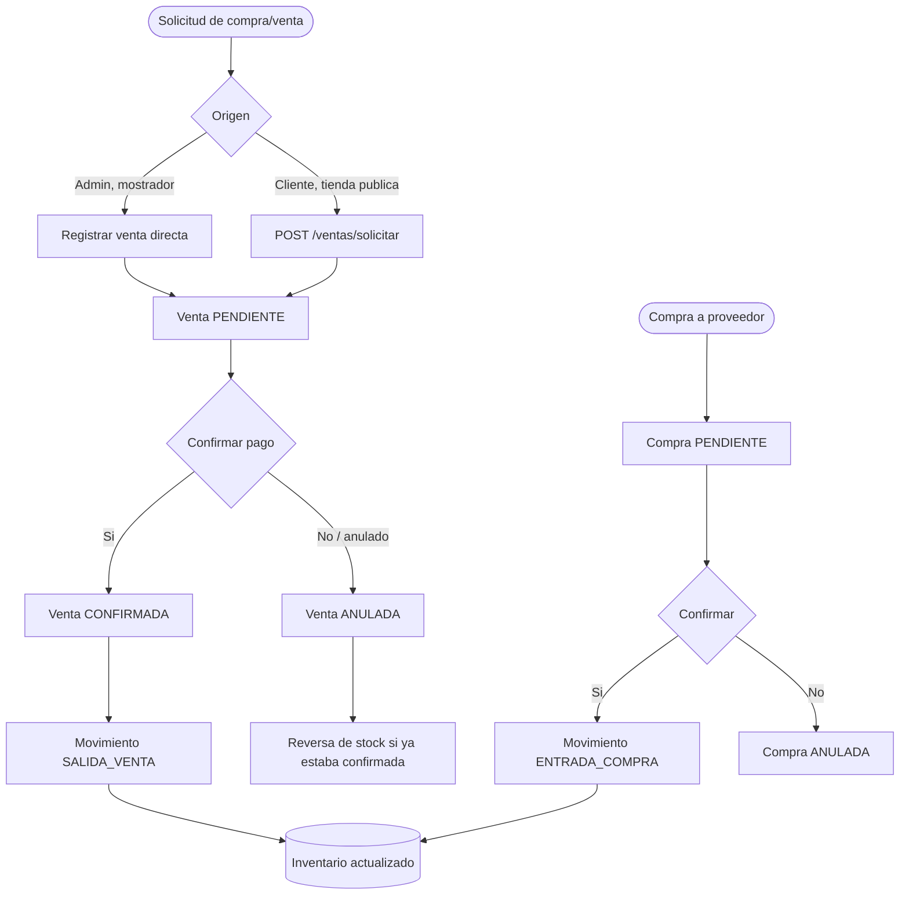
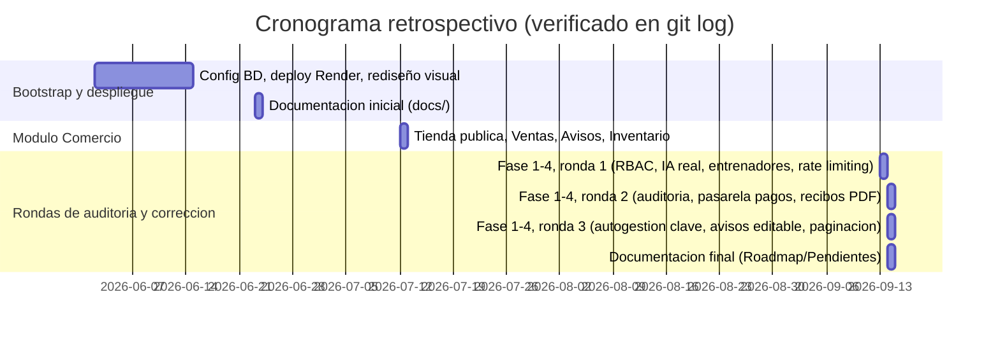
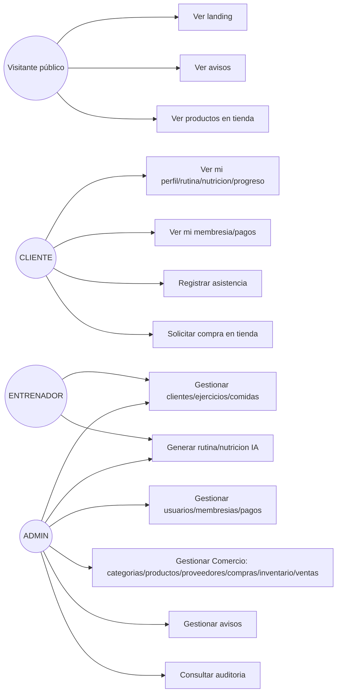
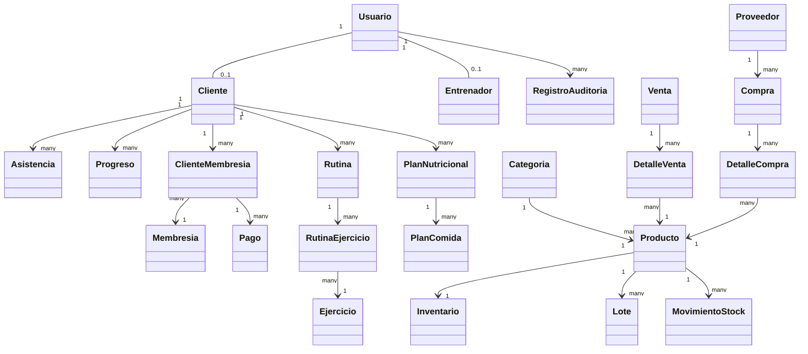
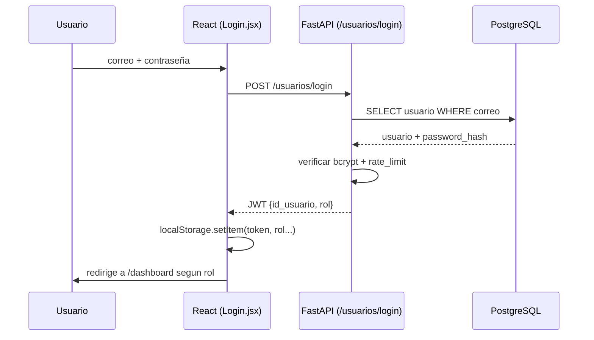
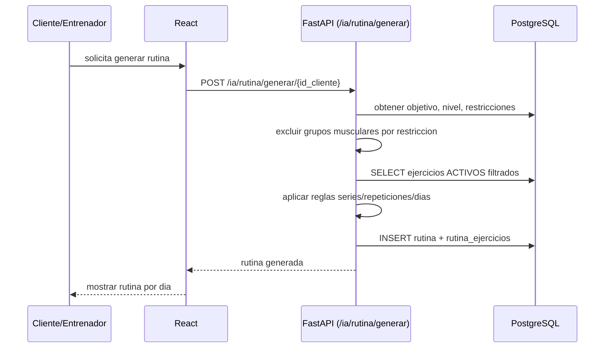

# Intervención Metodológica

# SistemaGimnasioGleyforGym

> **Cómo se construyó este documento**: cada sección se redactó verificando directamente el código real (`backend/`, `web-admin/`, `backend/app/models.py`) y no la documentación previa de `docs/`, que en varios puntos describía una versión anterior del sistema (13 tablas en vez de 26, módulos de Comercio/Avisos/Auditoría/Entrenadores no documentados). Donde se detectó una brecha, se corrigió el archivo de `docs/` correspondiente además de reflejarlo aquí. La app móvil (Flutter) queda fuera de alcance de este documento, a pedido explícito.

---

## 1. Comprensión del negocio

### 1.1. Definición del problema

GleyforGym es un gimnasio que necesitaba dejar de operar con procesos manuales/dispersos (fichas en papel o hojas de cálculo, cobro de membresías sin trazabilidad, rutinas y planes nutricionales armados a mano por cada entrenador) para pasar a una plataforma única que centralice: control de acceso por rol, ficha biométrica del socio, venta y control de membresías, control de asistencia física, seguimiento de progreso corporal, generación asistida de rutinas y planes nutricionales, y — como ampliación de alcance verificada en el código pero nunca formalizada como requerimiento — una pequeña tienda de productos del gimnasio (suplementos/merchandising) con control de inventario.

No se identificó ninguna normativa ISO que el negocio del gimnasio esté obligado a seguir (no es un proceso regulado); las referencias a estándares en el proyecto son de calidad de software, no de negocio: ISO/IEC 25010 para los requerimientos no funcionales (`docs/03_Analisis/Requerimientos_No_Funcionales.md`).

#### 1.1.1. Identificación de procesos (macroprocesos y procedimientos)

| ID | Proceso | Actor principal | Estado |
|---|---|---|---|
| P01 | Autenticación y control de roles (JWT, RBAC) | Todos los usuarios | Implementado |
| P02 | Gestión de fichas de clientes | Admin/Entrenador | Implementado |
| P03 | Ventas, pagos y membresías | Admin | Implementado |
| P04 | Registro de asistencia diaria | Cliente/Admin/Entrenador | Implementado |
| P05 | Prescripción y gestión de ejercicios | Entrenador/Admin | Implementado |
| P06 | Generación de rutinas (motor de reglas) | Motor IA/Entrenador | Implementado |
| P07 | Generación de nutrición (motor de reglas) | Motor IA/Entrenador | Implementado |
| P08 | Control de progreso físico | Cliente/Entrenador | Implementado |
| **P09** | **Gestión comercial (Comercio): categorías, productos, proveedores, compras, inventario, ventas** | Admin | Implementado, **sin RF/pruebas formales hasta esta revisión** |
| **P10** | **Avisos y comunicados públicos** | Admin | Implementado |
| **P11** | **Auditoría y trazabilidad de operaciones críticas** | Admin (solo vía API) | Implementado, **sin página en `web-admin`** |
| **P12** | **Gestión de entrenadores como entidad propia** | Admin (solo vía API) | Implementado, **sin página en `web-admin`** |

P09–P12 son la corrección principal de esta revisión: estaban en producción (verificado en `backend/app/routes/`) pero ausentes en `README.md` y en la documentación de arquitectura previa.

#### 1.1.2. Diagrama de procesos

Flujo general (procesos P01–P08, ya documentado en `README.md`, reproducido aquí sin cambios porque sigue siendo correcto):

Proceso P09 (Comercio) — nuevo, no documentado antes:

Procesos P10–P12 son de menor complejidad (CRUD simple protegido por rol) y no requieren diagrama propio; su detalle está en `docs/04_Arquitectura/Arquitectura_Backend.md`.

### 1.2. Identificación de actores

**Actores de negocio (sistema en operación):**
- ADMIN: dueño/administrador del gimnasio.
- ENTRENADOR: staff deportivo.
- CLIENTE: socio del gimnasio.
- Visitante público (sin login): landing, avisos, tienda de solo lectura.

**Equipo de desarrollo (este proyecto):**
- Keen Guerra Lozano
- Yago Imanol Espinoza Tiza
- Elizabeth Antonela Inciso Aguilar

> **Nota de verificación honesta**: el historial de Git de este repositorio solo registra los alias `KeenGuerra` y `AbranUs` (~59 commits en total), y el equipo confirmó que ambos alias corresponden a **Keen Guerra Lozano** — es decir, la autoría de código verificable en Git es 100% de Keen Guerra Lozano. Los aportes específicos de Yago Espinoza Tiza y Elizabeth Inciso Aguilar (análisis, documentación, pruebas manuales, gestión, etc.) no quedan registrados en el historial de este repositorio; la matriz RACI de abajo refleja roles declarados por el equipo, no verificados en código, salvo la columna de Keen Guerra en tareas técnicas.

**Matriz RACI** (R=Responsable, A=Aprobador, C=Consultado, I=Informado):

| Proceso / Actividad | Keen Guerra Lozano | Yago Espinoza Tiza | Elizabeth Inciso Aguilar |
|---|---|---|---|
| Definición del problema y alcance | C | R | A |
| Levantamiento de requisitos (RF/RNF) | C | R | A |
| Diseño de base de datos y arquitectura | R | C | I |
| Desarrollo backend (FastAPI) | **R** (verificado en Git) | I | I |
| Desarrollo frontend (React) | **R** (verificado en Git) | I | I |
| Motor de reglas IA (rutinas/nutrición) | **R** (verificado en Git) | C | I |
| Pruebas (casos de prueba, ejecución) | C | C | R |
| Documentación (`docs/`) | C | R | A |
| Despliegue (Render) | **R** (verificado en Git) | I | I |
| Control de calidad / revisión final | I | C | A |

### 1.3. Definición del "modelo predictivo"

**Decisión explícita de esta revisión**: el motor de "IA" de GleyforGym **no es un modelo de machine learning entrenado**. Es un sistema **basado en reglas, 100% determinístico**, verificado directamente en `backend/app/ia/rutina/` y `backend/app/ia/nutricion/` (sin imports de scikit-learn/pandas/numpy ni artefacto de modelo serializado). Esto ya es una decisión de arquitectura documentada como **DA-009** en `docs/07_Gestion_Proyecto/Decisiones_Arquitectura.md`. Forzar aquí un encuadre de "supervisado/no supervisado" sería inexacto; se documenta lo que el código realmente hace.

**Variables de entrada:**
- Motor de rutinas: `objetivo`, `nivel`, `restricciones_medicas` del cliente.
- Motor de nutrición: `peso`, `estatura`, `edad` (derivada de `fecha_nacimiento`), `sexo`, `nivel_actividad`, `objetivo`, `restricciones_medicas`.

**Tipo de algoritmo:**
- Rutinas: reglas if/else que mapean objetivo→series/repeticiones/descanso, nivel→días de entrenamiento por semana, y un diccionario `RESTRICCION_GRUPOS_EXCLUIDOS` que excluye grupos musculares según la restricción médica declarada (ej. RODILLA/CADERA excluye piernas). La selección final de ejercicios dentro de cada grupo permitido es aleatoria (`random.shuffle`) entre los que pasan los filtros de estado ACTIVO y nivel apto.
- Nutrición: fórmula **Mifflin-St Jeor** explícita (`BMR = 10·peso + 6.25·estatura_cm − 5·edad + constante_sexo`, `TDEE = BMR × multiplicador_actividad`), con ajuste calórico por objetivo (déficit −500 kcal o superávit +350 kcal) y reparto de macros (proteína 1.8 g/kg, grasa 25% de calorías, resto en carbohidratos). Las comidas concretas se eligen por la que más se acerque al presupuesto calórico de cada franja horaria, filtradas por objetivo y estado ACTIVO. Las restricciones médicas se guardan en el plan como referencia informativa, pero no filtran el catálogo de comidas (limitación real, no documentada antes).

---

## 2. Planificación del proyecto

### 2.1. Plan de trabajo

**Nota de verificación**: `README.md` describe versiones v1.0.0 (15/01/2026) a v2.1.0 (20/05/2026) que preceden al primer commit de este repositorio Git (`d5cb67f`, 2026-06-02). Es decir, hubo trabajo previo no versionado en este repo, o el historial se reinició en junio. El Gantt siguiente cubre únicamente lo verificable en `git log` de este repositorio.

**Recursos:**

| Recurso | Uso | Duración |
|---|---|---|
| 1 desarrollador full-stack (Keen Guerra Lozano) | Backend + Frontend + BD + Despliegue | Todo el proyecto (verificado en Git) |
| Equipo de análisis/documentación/pruebas (Yago Espinoza Tiza, Elizabeth Inciso Aguilar) | Requisitos, documentación, pruebas manuales | Todo el proyecto (no verificable en Git) |
| Render (free tier) | Hosting backend + frontend + PostgreSQL | Desde despliegue inicial |
| Cloudinary (free tier) | CDN de videos/imágenes | Desde integración de ejercicios |
| SonarQube (local) | Análisis de calidad de código | Continuo |

No se cuenta con información económica de gastos del proyecto (ambos servicios usados están en su plan gratuito).

### 2.2. Modelo de ciclo de vida

**Elegido: iterativo-incremental**, evidenciado por el propio historial de commits: el trabajo se organiza en "Fases" (ej. `Fase 1: RBAC`, `Fase 2: motor de IA real`) agrupadas en "rondas de revisión" (1ra, 2da, 3ra revisión), cada una entregando una porción funcional verificable e independientemente desplegable. No es Scrum formal (no hay evidencia de sprint backlog, ceremonias, ni herramienta de gestión de tickets como Jira/Trello), pero comparte su lógica de entregas cortas y acotadas por funcionalidad — es más cercano a un **Kanban informal por fases** que a un ciclo en cascada.

Etapas internas por fase (inferidas del patrón real de commits):
1. Identificar el hallazgo o brecha (auditoría de código).
2. Implementar la corrección/funcionalidad en un commit acotado.
3. Documentar el cambio (`docs/`) cuando corresponde.

### 2.3. Definición de roles del equipo

| Rol | Responsable | Evidencia |
|---|---|---|
| Analista de requisitos | Yago Espinoza Tiza (declarado) | — |
| Arquitecto / Desarrollador full-stack | Keen Guerra Lozano | Git: 100% de los commits |
| Tester / QA | Elizabeth Inciso Aguilar (declarado) | — |
| Documentación técnica | Yago Espinoza Tiza / Elizabeth Inciso Aguilar (declarado) | — |
| DevOps (despliegue Render) | Keen Guerra Lozano | Git: commits de `render.yaml` y fixes de despliegue |

### 2.4. Herramientas de gestión

> Verificado en `web-admin/package.json`, `backend/requirements.txt`, `sonar-project.properties`. **No se usó JIRA, Trello, MS Project ni Figma** — no hay evidencia de ninguno en el repositorio.

| Categoría | Herramienta real |
|---|---|
| Comunicación/coordinación | Ninguna herramienta formal (equipo reducido) |
| Definición de actividades | Mensajes de commit estructurados por "Fase" (sustituto informal de un backlog) |
| Cronograma de desarrollo | Ninguno formal; reconstruido en 2.1 a partir de `git log` |
| Lenguaje de programación (backend) | Python 3.12 |
| Lenguaje de programación (frontend) | JavaScript (JSX) |
| Framework backend | FastAPI 0.136 + SQLAlchemy 2.0 + Pydantic 2.13 |
| Framework frontend | React 19 + Vite 8 + React Router DOM 7 + Axios 1.15 + Recharts 3.8 |
| Gestor de base de datos | PostgreSQL (psycopg2) |
| IDE de desarrollo | Visual Studio Code (inferido por convención del proyecto) |
| Prototipos/mockups | Imágenes estáticas documentadas en `docs/09_mockups/` (no Figma/Canva interactivo) |
| Modelado de sistema | Mermaid (este documento), no Bizagi/UML tool dedicado |
| Testing backend | pytest 9 + pytest-cov + coverage |
| Testing frontend | Vitest 3 + @testing-library/react + @vitest/coverage-v8 |
| Calidad de código | SonarQube (servidor local `http://localhost:9000`) |
| Control de versiones | Git + GitHub |

### 2.5. Planificación de pruebas

Ver `docs/05_Desarrollo/Plan_Pruebas.md` (ampliado en esta revisión con los módulos de Comercio, Avisos, Auditoría y Entrenadores, antes ausentes de la tabla "Módulos a Validar").

Estrategias aplicadas: basadas en requisitos (trazabilidad RF↔CP) y basadas en riesgo (prioridad Alta para módulos que manejan dinero: Pagos, Compras, Ventas). No se aplicaron pruebas exploratorias formales documentadas ni automatización end-to-end (Selenium/Cypress no están en el stack).

---

## 3. Análisis de requisitos

### 3.1. Requerimientos funcionales y no funcionales

- `docs/03_Analisis/Requerimientos_Funcionales.md`: **RF-001 a RF-226** (los RF-176 a RF-226 se agregaron en esta revisión para Entrenadores, Avisos, Auditoría y todo el módulo Comercio, que estaban en producción sin RF formal).
- `docs/03_Analisis/Requerimientos_No_Funcionales.md`: RNF-001 a RNF-030, alineados a ISO/IEC 25010. No requirió corrección — ya cubría el sistema de forma general (rendimiento, seguridad, escalabilidad SaaS).

### 3.2. Criterios de aceptación

`docs/05_Desarrollo/Casos_Prueba.md`: **CP-001 a CP-073** (CP-056 a CP-073 agregados en esta revisión para los mismos módulos). Formato: Objetivo + Resultado Esperado, siguiendo el patrón ya usado en el documento para los "Nuevos Casos de Prueba: Estabilización v2.6".

### 3.3. Priorización de requerimientos

Técnica usada: **clasificación por prioridad Alta/Media/Baja** (ya aplicada de forma consistente en todo `Requerimientos_Funcionales.md`, incluidos los RF nuevos de esta revisión). Ejemplo de la lógica aplicada a los módulos nuevos: Alta para lo que mueve dinero o afecta stock (registrar compra, confirmar compra, registrar venta, checkout, webhook de pago, auditoría), Media para gestión de catálogo (categorías, productos, proveedores), Baja para operaciones secundarias (editar/eliminar categoría).

### 3.4. Product backlog

Reconstruido en orden real de implementación (evidencia de `git log`, no un backlog planificado de antemano):

1. Bootstrap: BD, modelos base, CRUDs de clientes/membresías/ejercicios.
2. Login, JWT, bcrypt, roles.
3. Motor de IA (rutinas y nutrición), Cloudinary.
4. Rediseño visual, despliegue en Render, PostgreSQL en producción.
5. Módulo Comercio completo (categorías, productos, proveedores, compras, inventario, ventas, tienda pública) + Avisos.
6. Ronda de auditoría 1: RBAC completo, motor de IA real con restricciones médicas, entrenadores como entidad, KPIs, rate limiting.
7. Ronda de auditoría 2: trazabilidad/auditoría, arquitectura de pasarela de pagos, reset de contraseña, recibos PDF.
8. Ronda de auditoría 3: autogestión de contraseñas, avisos editables, KPI de asistencias, paginación.
9. Esta revisión: RF/CP/documentación de arquitectura actualizados para reflejar Comercio/Avisos/Auditoría/Entrenadores.

---

## 4. Diseño y modelado del sistema

### 4.1. Arquitectura del software

Arquitectura general en capas (presentación → servicios FastAPI → negocio → datos PostgreSQL → externos Cloudinary), documentada y vigente en `docs/04_Arquitectura/Arquitectura_General.md`. Corregido en esta revisión: `Arquitectura_Backend.md` pasó de listar 10 a **21 routers reales** + submódulo `ia/`, y ahora incluye los módulos de soporte no documentados antes (`pagos_gateway/` con patrón strategy, `rate_limit.py`, `recibos.py`, `auditoria.py`).

Framework backend: FastAPI con enrutamiento por módulo (`app/routes/*.py`), sin capas MVC explícitas — la validación vive en `schemas.py` (Pydantic), la persistencia en `models.py` (SQLAlchemy), y la lógica de negocio dentro de cada router o en `app/ia/`.

### 4.2. Diseño de base de datos

- **Modelo conceptual**: ver diagrama de relaciones en `docs/04_Arquitectura/Arquitectura_BaseDatos.md` sección 3 (usuarios→clientes→{asistencias, progreso, membresías, rutinas, nutrición}, más el bloque comercial independiente productos↔inventario↔lotes↔movimientos↔{compras, ventas}).
- **Modelo lógico / físico**: 26 tablas reales en PostgreSQL vía SQLAlchemy, documentadas campo por campo en `Arquitectura_BaseDatos.md` (corregido en esta revisión de 13 a 26 tablas).
- **Normalización**: el esquema ya está en 3FN — no hay grupos repetitivos (las medidas corporales están en columnas separadas por decisión explícita DA-013, no repetidas), las claves foráneas evitan duplicar datos (ej. `precio_asignado` en `cliente_membresias` es la única excepción intencional — un dato desnormalizado a propósito para "congelar" el precio histórico, DA-010) y las tablas intermedias resuelven las relaciones N:M reales (`cliente_membresias` entre clientes y membresías; `detalle_compras`/`detalle_ventas` entre compras/ventas y productos).

### 4.3. Modelado del sistema (UML)

#### 4.3.1. Diagrama de casos de uso

#### 4.3.2. Diagrama de clases (réplica del modelo de datos real)

#### 4.3.3. Diagrama de secuencia — Login

#### 4.3.4. Diagrama de secuencia — Generación de rutina IA

### 4.4. Modelado de interfaces (prototipos)

`docs/09_mockups/`: 3 mockups estilo "Dark Luxury Glassmorphic". Verificado en esta revisión: `dashboard_mockup.png` corresponde 1:1 a `DashboardAdmin.jsx` (web); `routine_mockup.png` y `nutrition_mockup.png` ilustran pantallas de la **app móvil** (Flutter), no las páginas web equivalentes `MiRutina.jsx`/`MiNutricion.jsx` — no existe mockup propio para estas últimas ni para ningún módulo de Comercio/Avisos.

---

## 5. Desarrollo y codificación del sistema

### 5.1. Implementación de funcionalidades

Ver Product Backlog retrospectivo (sección 3.4) y Gantt (sección 2.1) — ambos reconstruidos de los mensajes de commit reales, agrupados por "Fase N (ronda de revisión)".

### 5.2. Control de versiones

`docs/05_Desarrollo/Flujo_Git.md` describe la estrategia recomendada (main/develop/feature-*, conventional commits); en la práctica real el equipo trabajó con commits directos agrupados por fase funcional en lugar de branches por feature (verificado: el `git log` no muestra merges de feature branches, es historia lineal). Mensajes reales de ejemplo: `"Fase 2 (backend): motor de IA real - restricciones medicas, nivel y calorias"`, `"Fase 1 (3ra revision): autogestion de contrasenas"`.

### 5.3. Buenas prácticas de programación

`docs/05_Desarrollo/Convenciones_Codigo.md` (vigente, verificado sin inconsistencias): snake_case en backend Python, PascalCase para componentes/clases, camelCase en JS.

---

## 6. Desarrollo de pruebas

### 6.1. Diseño de casos de prueba

- Backend: `backend/tests/test_backend.py` (48 funciones `test_`, sobre `TestClient` + SQLite) y `test_crud.py` (7 funciones).
- Frontend: 33 archivos `*.test.jsx`/`*.test.js` (Vitest + @testing-library/react), patrón `vi.mock` de `api` + `render`/`screen`/`fireEvent` + `MemoryRouter`.
- Trazabilidad RF↔CP: ver `docs/05_Desarrollo/Casos_Prueba.md` (CP-001 a CP-073).

Caja negra (funcionalidad/UI, ej. CP-001 Login), caja blanca (cobertura de línea vía `pytest-cov`/`@vitest/coverage-v8`), y exploratoria (rondas de auditoría manual documentadas en `Pendientes.md`).

### 6.2. Resultados de pruebas

**Ejecutado en esta revisión** (no se repite la cifra de "96.43%" del README, que no es un artefacto verificable):

| Suite | Resultado |
|---|---|
| Backend (`pytest --cov`) | **55 tests pasando**, cobertura total **81%** (3113 statements) |
| Frontend (`vitest run --coverage`) | **143 tests pasando** en 33 archivos, cobertura total **78.21%** de statements |

Detalle relevante — módulos "clásicos" (usuarios, clientes, membresías, pagos, IA, avisos, auditoría) entre 87% y 100% de cobertura backend; módulo Comercio muy por debajo y **sin ninguna función `test_` dedicada**: `categorias.py` 37%, `proveedores.py` 43%, `inventario.py` 26%, `productos.py` 23%, `compras.py` 20%, `ventas.py` 17%. En frontend, las páginas de Comercio están entre 1.3% y 2.8% (solo se ejecuta el import del componente, ninguna interacción real probada): `Categorias.jsx` 1.8%, `Productos.jsx` 1.37%, `Proveedores.jsx` 2.83%, `Compras.jsx` 1.5%, `Inventario.jsx` 1.66%, `Ventas.jsx` 1.59%, `Tienda.jsx` 2.41%. `NotFound.jsx` (23.52%) y `Navbar.jsx` (83.33%) también confirman la brecha ya señalada en `Pendientes.md` P-08.

### 6.3. Automatización de pruebas

Automatizado con **pytest-cov** (backend) y **Vitest + @vitest/coverage-v8** (frontend), ejecutados manualmente por el equipo — no hay integración continua (`Pendientes.md` P-09: no existe `.github/workflows`). No se usa Selenium/Cypress ni ninguna herramienta de automatización end-to-end.

---

## 7. Implementación o despliegue

### 7.1. Configuración de entorno de despliegue

`render.yaml` (verificado, vigente) define 3 servicios en Render.com:
- **Web service** `gleyforgym-backend` (FastAPI): `pip install -r requirements.txt`, arranca con `python create_db.py && uvicorn app.main:app`. Variables: `DATABASE_URL` (enlazada), `SECRET_KEY` (autogenerada), `ALGORITHM=HS256`, `ACCESS_TOKEN_EXPIRE_MINUTES=60`, `CLOUDINARY_URL` (manual), `CORS_ORIGINS`.
- **Static site** `gleyforgym-frontend` (React/Vite): `npm install && npm run build`, rewrite SPA. Variable: `VITE_API_URL`.
- **PostgreSQL administrado** `gleyforgym-db` (plan free — expira a los 90 días sin upgrade, riesgo ya documentado en `Pendientes.md` P-16).

No existe `Dockerfile` ni `docker-compose.yml` en ningún directorio (confirmado por búsqueda exhaustiva).

### 7.2. Validación de funcionamiento en producción

El sistema está desplegado y accesible según `render.yaml`; esta revisión no incluyó una verificación en vivo de la URL de producción (fuera del alcance de una auditoría de código estático). Se recomienda que el equipo confirme manualmente que el dominio responde antes de considerar esta sección cerrada.

---

## 8. Monitoreo del sistema — motor de reglas (no ML entrenado)

> Reformulado por decisión explícita del equipo (ver sección 1.3): en lugar de forzar dataset 80/20, accuracy/F1/matriz de confusión sobre un sistema que no los tiene, se documenta lo que el motor real hace y cómo se valida en la práctica.

### 8.1. Comprensión de los "datos" del motor

Fuente de datos: perfil biométrico y de objetivo del cliente (`clientes`), catálogo de ejercicios (`ejercicios`) y catálogo de comidas (`comidas`), ambos filtrados por `estado = ACTIVO` (RN-030/RN-032). No hay ingesta externa ni dataset histórico de entrenamiento.

### 8.2. "Preparación" — filtros aplicados

- Rutinas: exclusión de grupos musculares por restricción médica (`RESTRICCION_GRUPOS_EXCLUIDOS`), filtro por nivel apto del ejercicio, filtro por estado ACTIVO.
- Nutrición: filtro de comidas por objetivo (o "GENERAL") y estado ACTIVO; selección de la comida cuya caloría real esté más cerca del presupuesto de cada franja horaria.

### 8.3. "Modelado" — algoritmo real

Heurísticas if/else (rutinas) + fórmula matemática Mifflin-St Jeor (nutrición), ver detalle completo en sección 1.3. No hay entrenamiento ni ajuste de parámetros por aprendizaje — los "parámetros" son constantes de negocio (`constants.py`: multiplicadores de actividad, proporciones de macros, series/repeticiones por objetivo) que el equipo puede ajustar manualmente.

### 8.4. "Evaluación" — validación real usada por el proyecto

No hay accuracy/F1/matriz de confusión porque no hay clasificación ni predicción supervisada que evaluar contra un ground truth. La validación real documentada en el AI-DLC del proyecto (`README.md` sección 8) es **cualitativa y humana**: los entrenadores del gimnasio evaluaron una muestra de 100 rutinas generadas al azar para verificar coherencia metodológica y ausencia de ejercicios peligrosos dado el perfil médico del cliente (ej. que un cliente con lesión de rodilla no reciba sentadillas pesadas). Esta es la métrica de éxito real y verificable del proyecto, no una cifra de ML.

### 8.5. Despliegue e interpretación

- **Integración**: endpoints `POST /ia/rutina/generar/{id_cliente}` y `POST /ia/nutricion/generar/{id_cliente}`, ya en producción.
- **Alcance y limitaciones**: el motor de nutrición no filtra el catálogo de comidas por restricción médica (solo la guarda como referencia informativa) — es una limitación real detectada en esta revisión, no documentada antes.
- **Reportes para decisiones**: `GET /reportes/kpis` consolida cuántas rutinas/planes fueron generados por el motor (`generada_por_ia = TRUE`) frente a los creados manualmente, dato que sí es cuantitativo y verificable en producción.

---

## 9. Mantenimiento y mejora continua

### 9.1. Manual de usuario

No existe un manual de usuario dedicado; el comportamiento por rol está documentado funcionalmente en `docs/02_Negocio/Roles_Permisos.md` (qué puede ver/hacer cada rol) y en los mockups de `docs/09_mockups/`. Se recomienda al equipo redactar uno breve por rol (ADMIN/ENTRENADOR/CLIENTE) si el documento se usa de cara a evaluación de tesis.

### 9.2. Manual de instalación y mantenimiento

Vigente y verificado: `docs/05_Desarrollo/Guia_Instalacion.md` (instalación local) y `docs/05_Desarrollo/Manual_Desarrollador.md` (cómo agregar endpoint/pantalla/tabla nueva) y `docs/05_Desarrollo/Guia_Despliegue.md` (despliegue en Render/VPS/PaaS).

### 9.3. Escalabilidad y seguridad a largo plazo

La fuente más confiable y honesta del propio proyecto para esta sección es `docs/07_Gestion_Proyecto/Pendientes.md` (P-01 a P-17), que no se repite aquí completo. Resumen de lo más relevante para escalabilidad/seguridad:

- **Alta prioridad**: sin verificación de correo al registro (P-01); pasarela de pago aún en modo simulación (`MockGateway`, arquitectura lista para `CulqiGateway`, P-02); envío de correo real pendiente (P-03); **0% de pruebas dedicadas en Comercio** (P-04, confirmado con cifras reales en la sección 6.2 de este documento).
- **Media**: sin alertas de vencimiento de membresía (P-05); sin exportación PDF de rutinas/nutrición (P-06, solo existe para recibos de pago); sin CI/CD (P-09); rate limiting de login solo en memoria, no distribuido (P-10, aceptable en el tier actual de un solo worker).
- **Baja**: migración pendiente de `class Config` a `ConfigDict` en Pydantic v2 (P-12); sin Docker (P-13); sin monitoreo/APM (P-14); sin backups propios fuera de Render (P-15); riesgo del plan free de Render — cold starts y expiración de BD a 90 días (P-16).

Adicional detectado en esta revisión (no estaba en `Pendientes.md`): **no existe página propia en `web-admin` para gestionar Entrenadores ni para consultar Auditoría** — ambos módulos son solo API, protegidos correctamente por rol, pero sin interfaz. Se recomienda agregarlo como punto P-18 si el equipo actualiza `Pendientes.md`.
