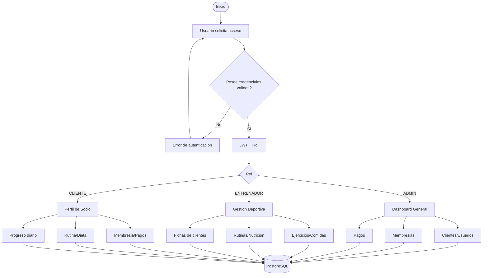
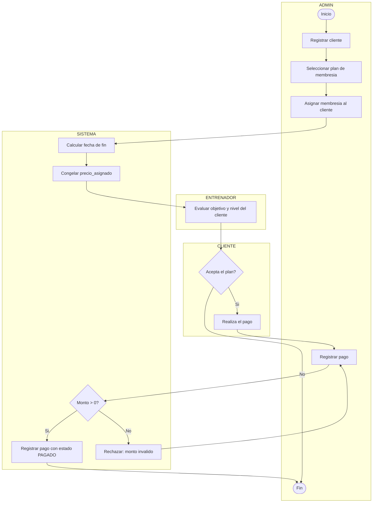
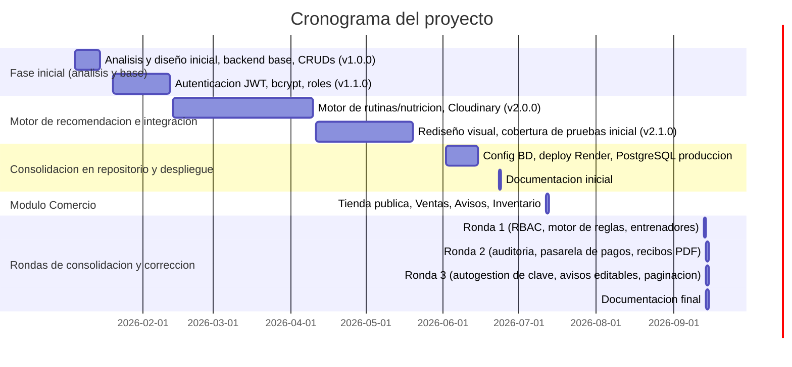
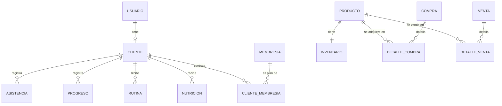
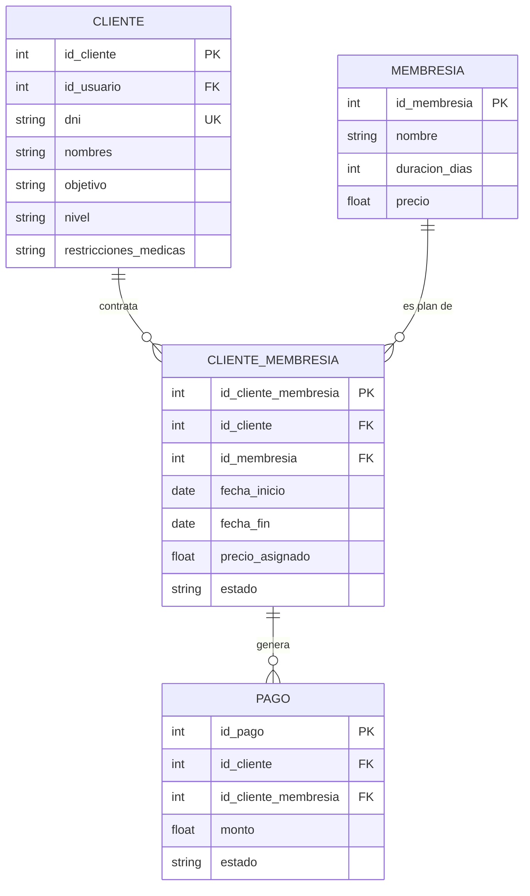
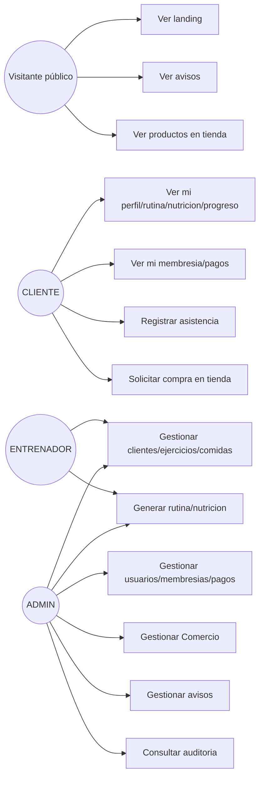
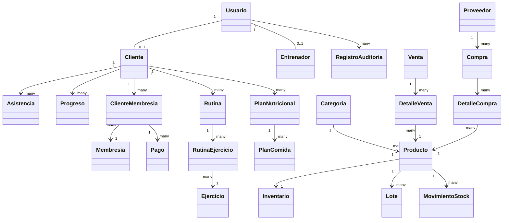
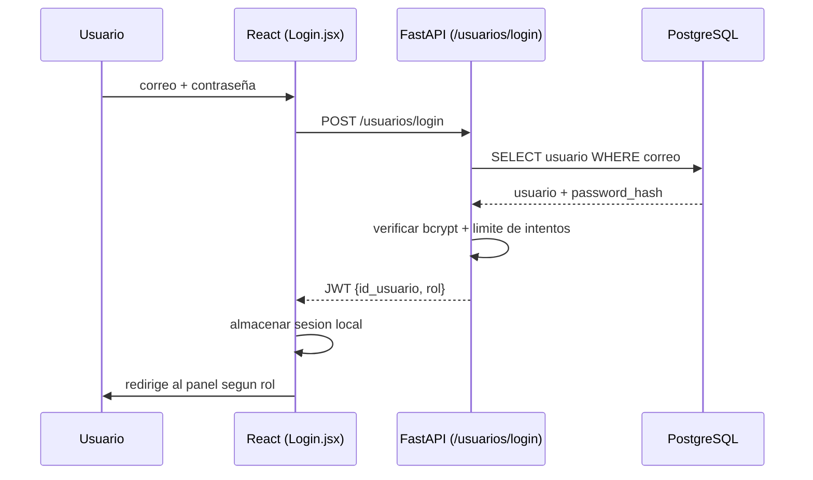
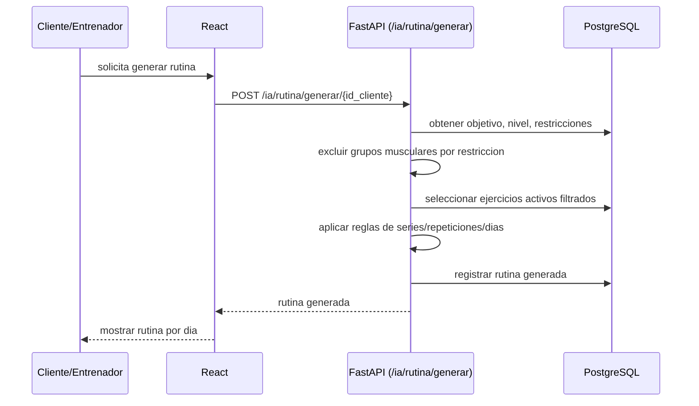

# Intervención Metodológica

# Sistema Gimnasio GleyforGym

> La información de este capítulo se obtuvo mediante verificación directa del código fuente del sistema (`backend/`, `web-admin/`) y de su historial de control de versiones, en lugar de inferirse de documentación previa del proyecto. El alcance cubre el sistema web (backend FastAPI + panel de administración React); la aplicación móvil complementaria (Flutter) queda fuera del alcance formal de este documento.
>
> **Relación con el Plan de Tesis**: este documento describe el proceso de *ingeniería de software* (cómo se construyó, probó y desplegó el sistema). El diseño de *investigación* formal del proyecto — enfoque cuantitativo, diseño preexperimental con pretest y postest en un solo grupo (`G: O₁ → X → O₂`), población de 120 usuarios activos, muestra de 92 usuarios, instrumentos validados y análisis estadístico (Shapiro-Wilk, t-Student/Wilcoxon) — se define en el Capítulo III del Plan de Tesis y no se duplica aquí. Donde este documento mide un indicador que coincide con uno de la matriz de operacionalización del Plan de Tesis (ej. tiempo de respuesta del sistema, cumplimiento funcional), se cita explícitamente la correspondencia.

---

## 1. Comprensión del negocio

### 1.1. Definición del problema

GLEYFORGYM es un gimnasio ubicado en la provincia de Chupaca, región Junín, Perú, cuyos procesos administrativos, deportivos y comerciales se gestionan de forma manual: registro de clientes y membresías en cuadernos y hojas sueltas, control de pagos sin sistema unificado, registro de asistencias sin consolidación, seguimiento físico sin registro sistemático, e inexistencia de reportes consolidados para la toma de decisiones (Plan de Tesis, Tabla 3 "Situación actual de la gestión de procesos del gimnasio GLEYFORGYM"). Esta situación generaba duplicidad de registros, pérdida de información, demoras en la atención e incapacidad para ajustar oportunamente rutinas y planes nutricionales.

El proyecto responde a esta problemática con una plataforma web que centraliza: control de acceso por rol, ficha biométrica del socio, venta y control de membresías, registro de asistencia física, seguimiento de progreso corporal, y generación asistida de rutinas y planes nutricionales mediante un motor de recomendación. Durante el levantamiento de requisitos se identificó además una ampliación de alcance ya implementada en el sistema: una tienda de productos del gimnasio (suplementos y merchandising) con control de inventario, categorías, proveedores y compras — correspondiente a la dimensión de **gestión comercial** del Plan de Tesis.

**Población y muestra** (tomadas del Plan de Tesis, sección 3.4, ya calculadas con la fórmula de poblaciones finitas para un nivel de confianza del 95% y margen de error del 5%): la población está conformada por los **120 usuarios activos** del gimnasio GLEYFORGYM que participan en los procesos administrativos, deportivos y comerciales; la muestra queda conformada por **92 usuarios activos**, seleccionados mediante muestreo probabilístico aleatorio simple.

El negocio del gimnasio no está sujeto a ninguna normativa ISO obligatoria por tratarse de un servicio no regulado. Las referencias a estándares en el proyecto corresponden a calidad de software, no a normativa de negocio: los requerimientos no funcionales de este documento se alinean al modelo de calidad ISO/IEC 25010 (ver sección 3.1), mientras que el Plan de Tesis cita ISO/IEC 9126-1 en sus bases teóricas para la característica de eficiencia. **Nota de unificación**: ISO/IEC 25010:2011 reemplazó formalmente a ISO/IEC 9126-1 como el modelo de calidad de producto de software vigente; las tres subcaracterísticas de eficiencia que usa el Plan de Tesis (comportamiento en el tiempo, utilización de recursos, cumplimiento de la eficiencia) provienen literalmente de 9126-1 y se conservan con el mismo nombre en 25010 bajo la característica "Eficiencia de desempeño" (*Performance efficiency*), por lo que ambos documentos son compatibles: 9126-1 es la fuente histórica de esas tres subcaracterísticas específicas, y 25010 es el estándar vigente usado para el resto del modelo de calidad en este documento.

#### 1.1.1. Identificación de procesos (macroprocesos y procedimientos)

**Tabla 1**

*Identificación de macroprocesos y procedimientos del sistema*

| ID | Proceso | Actor principal | Estado |
|---|---|---|---|
| P01 | Autenticación y control de roles (JWT, RBAC) | Todos los usuarios | Implementado |
| P02 | Gestión de fichas de clientes | Administrador / Entrenador | Implementado |
| P03 | Ventas, pagos y membresías | Administrador | Implementado |
| P04 | Registro de asistencia diaria | Cliente / Administrador / Entrenador | Implementado |
| P05 | Prescripción y gestión de ejercicios | Entrenador / Administrador | Implementado |
| P06 | Generación de rutinas (motor de recomendación) | Motor de reglas / Entrenador | Implementado |
| P07 | Generación de nutrición (motor de recomendación) | Motor de reglas / Entrenador | Implementado |
| P08 | Control de progreso físico | Cliente / Entrenador | Implementado |
| P09 | Gestión comercial: categorías, productos, proveedores, compras, inventario, ventas | Administrador | Implementado |
| P10 | Avisos y comunicados públicos | Administrador | Implementado |
| P11 | Auditoría y trazabilidad de operaciones críticas | Administrador (vía API) | Implementado |
| P12 | Gestión de entrenadores como entidad de negocio | Administrador (vía API) | Implementado |

*Nota.* Elaboración propia, a partir de la verificación directa de las rutas del backend (`backend/app/routes/`).

El levantamiento de requisitos sobre el código real identificó cuatro procesos (P09–P12) que ya están implementados y desplegados pero que no estaban documentados formalmente en las primeras versiones del análisis de requisitos del proyecto; esta intervención los incorpora con sus respectivos requerimientos funcionales (sección 3.1).

#### 1.1.2. Diagrama de procesos

Flujo general de autenticación y acceso por rol (P01–P08):

**Figura 1**

*Diagrama de flujo: autenticación y acceso por rol (P01–P08)*

```mermaid
graph TD
    A([Inicio]) --> B[Usuario solicita acceso]
    B --> C{Posee credenciales validas?}
    C -- No --> D[Error de autenticacion] --> B
    C -- Si --> E[JWT + Rol]
    E --> F{Rol}
    F -- ADMIN --> G1[Dashboard General] --> G2[Clientes/Usuarios] & G3[Membresias] & G4[Pagos]
    F -- ENTRENADOR --> H1[Gestion Deportiva] --> H2[Ejercicios/Comidas] & H3[Rutinas/Nutricion] & H4[Fichas de clientes]
    F -- CLIENTE --> I1[Perfil de Socio] --> I2[Membresia/Pagos] & I3[Rutina/Dieta] & I4[Progreso diario]
    G2 & G3 & G4 & H2 & H3 & H4 & I2 & I3 & I4 --> J[(PostgreSQL)]
```

*Nota.* Elaboración propia, a partir de `backend/app/main.py` y los routers protegidos por rol.

Proceso P09 — gestión comercial:

**Figura 2**

*Diagrama de flujo: proceso P09, gestión comercial (compras y ventas)*

```mermaid
graph TD
    A([Solicitud de compra/venta]) --> B{Origen}
    B -- Admin, mostrador --> C[Registrar venta directa]
    B -- Cliente, tienda publica --> D[POST /ventas/solicitar]
    C --> E[Venta PENDIENTE]
    D --> E
    E --> F{Confirmar pago}
    F -- Si --> G[Venta CONFIRMADA] --> H[Movimiento SALIDA_VENTA] --> I[(Inventario actualizado)]
    F -- No / anulado --> J[Venta ANULADA] --> K[Reversa de stock si ya estaba confirmada]
    L([Compra a proveedor]) --> M[Compra PENDIENTE] --> N{Confirmar}
    N -- Si --> O[Movimiento ENTRADA_COMPRA] --> I
    N -- No --> P[Compra ANULADA]
```

*Nota.* Elaboración propia, a partir de `backend/app/routes/compras.py` y `backend/app/routes/ventas.py`.

Los procesos P10–P12 son operaciones CRUD de menor complejidad, protegidas por rol, descritas en detalle en `docs/04_Arquitectura/Arquitectura_Backend.md`.

Diagrama de proceso con carriles (BPMN) para el flujo de asignación de membresía y registro de pago (P02–P03), el de mayor relevancia de negocio:

**Figura 3**

*Diagrama de proceso con carriles (BPMN): asignación de membresía y registro de pago (P02–P03)*

```mermaid
flowchart TB
    subgraph L1[" ADMIN "]
        direction TB
        A1([Inicio]) --> A2[Registrar cliente]
        A2 --> A3[Seleccionar plan de membresia]
        A3 --> A4[Asignar membresia al cliente]
        A8[Registrar pago]
        A9([Fin])
    end
    subgraph L2[" ENTRENADOR "]
        direction TB
        B1[Evaluar objetivo y nivel del cliente]
    end
    subgraph L3[" CLIENTE "]
        direction TB
        C1{Acepta el plan?}
        C2[Realiza el pago]
    end
    subgraph L4[" SISTEMA "]
        direction TB
        D1[Calcular fecha de fin]
        D2[Congelar precio_asignado]
        D3{Monto > 0?}
        D4[Registrar pago con estado PAGADO]
        D5[Rechazar: monto invalido]
    end

    A4 --> D1 --> D2 --> B1 --> C1
    C1 -- No --> A9
    C1 -- Si --> C2 --> A8 --> D3
    D3 -- Si --> D4 --> A9
    D3 -- No --> D5 --> A8
```

*Nota.* Elaboración propia, equivalente funcional a un diagrama BPMN de Bizagi, expresado en notación Mermaid por no contar con licencia de esa herramienta.

Este diagrama cubre el requisito de modelado con carriles por actor solicitado por la metodología.

### 1.2. Identificación de actores

**Actores de negocio (roles definidos en el sistema):**
- **ADMIN**: administrador del gimnasio, con acceso completo al sistema.
- **ENTRENADOR**: staff deportivo, gestiona clientes, rutinas y nutrición.
- **CLIENTE**: socio del gimnasio, con acceso a su propia información.
- **Visitante público** (sin autenticarse): consulta la página de inicio, avisos y el catálogo de la tienda.

**Matriz RACI de procesos de negocio** (R = Responsable, A = Aprobador, C = Consultado, I = Informado):

**Tabla 2**

*Matriz RACI de procesos de negocio por rol del sistema*

| Proceso | ADMIN | ENTRENADOR | CLIENTE |
|---|---|---|---|
| Autenticación y control de roles (P01) | A | I | I |
| Gestión de fichas de clientes (P02) | A | R | C |
| Ventas, pagos y membresías (P03) | R | C | I |
| Registro de asistencia (P04) | A | R | R |
| Gestión de ejercicios (P05) | A | R | I |
| Generación de rutinas (P06) | A | R | C |
| Generación de nutrición (P07) | A | R | C |
| Control de progreso físico (P08) | I | C | R |
| Gestión comercial (P09) | R | I | C |
| Avisos y comunicados (P10) | R | I | I |
| Auditoría y trazabilidad (P11) | R | I | I |
| Gestión de entrenadores (P12) | R | I | I |

*Nota.* Elaboración propia.

**Equipo de desarrollo del proyecto:**
- Keen Guerra Lozano
- Yago Imanol Espinoza Tiza
- Elizabeth Antonela Inciso Aguilar

**Matriz RACI del equipo de desarrollo:**

**Tabla 3**

*Matriz RACI del equipo de desarrollo por actividad*

| Actividad | Keen Guerra Lozano | Yago Espinoza Tiza | Elizabeth Inciso Aguilar |
|---|---|---|---|
| Definición del problema y alcance | C | R | A |
| Levantamiento de requisitos (RF/RNF) | C | R | A |
| Diseño de base de datos y arquitectura | R | C | C |
| Desarrollo backend (FastAPI) | R | C | I |
| Desarrollo frontend (React) | R | C | I |
| Motor de recomendación (rutinas/nutrición) | R | C | I |
| Diseño y ejecución de pruebas | C | C | R |
| Documentación técnica | C | R | A |
| Despliegue (Render) | R | I | I |
| Control de calidad / revisión final | C | C | A |

*Nota.* Elaboración propia. R = Responsable, A = Aprobador, C = Consultado, I = Informado.

### 1.3. Definición del modelo de recomendación

El motor de generación de rutinas y planes nutricionales de GLEYFORGYM **no es un modelo de machine learning entrenado**, sino un **sistema basado en reglas, determinístico**, implementado en `backend/app/ia/rutina/` y `backend/app/ia/nutricion/`. Esta es una decisión de arquitectura explícita del proyecto (DA-009, `docs/07_Gestion_Proyecto/Decisiones_Arquitectura.md`), justificada por tres razones:

1. **Trazabilidad y seguridad clínica**: las restricciones médicas del cliente deben excluir determinísticamente ciertos grupos musculares (ej. una lesión de rodilla excluye ejercicios de pierna). Un modelo probabilístico introduciría el riesgo de recomendar, aunque sea ocasionalmente, un ejercicio contraindicado — inaceptable en un contexto de seguridad física.
2. **Volumen de datos insuficiente para entrenamiento supervisado confiable**: el sistema es de reciente despliegue y no cuenta todavía con el historial de uso necesario para entrenar y validar un modelo con métricas estadísticamente significativas (ver limitación detallada más abajo).
3. **Auditabilidad**: cada recomendación puede explicarse exactamente por la regla que la generó, lo cual es relevante tanto para la confianza del entrenador en la herramienta como para la propia evaluación académica del sistema.

**Variables de entrada:**
- Motor de rutinas: objetivo, nivel físico y restricciones médicas del cliente.
- Motor de nutrición: peso, estatura, edad (derivada de la fecha de nacimiento), sexo, nivel de actividad física, objetivo y restricciones médicas.

**Algoritmo — rutinas:** reglas que mapean objetivo → series/repeticiones/descanso, y nivel → días de entrenamiento por semana; un diccionario de exclusión (`RESTRICCION_GRUPOS_EXCLUIDOS`) descarta grupos musculares según la restricción médica declarada. La selección final de ejercicios dentro de cada grupo permitido se realiza aleatoriamente entre los que cumplen los filtros de estado activo y nivel apto.

**Algoritmo — nutrición:** fórmula de Mifflin-St Jeor (`TMB = 10·peso + 6.25·estatura_cm − 5·edad + constante_sexo`, `GET = TMB × multiplicador_de_actividad`), con ajuste calórico según objetivo (déficit de 500 kcal o superávit de 350 kcal) y reparto de macronutrientes (proteína 1.8 g/kg de peso, grasa 25% de las calorías totales, el resto en carbohidratos). Las comidas concretas se seleccionan por cercanía al presupuesto calórico de cada franja horaria, filtradas por objetivo y estado activo.

**Limitación identificada:** las restricciones médicas se almacenan en el plan nutricional como referencia informativa, pero actualmente no filtran el catálogo de comidas — a diferencia del motor de rutinas, que sí las aplica como filtro activo. Esta es una oportunidad de mejora concreta para una futura iteración del sistema.

**Evaluación de factibilidad de un modelo predictivo complementario:** se evaluó la posibilidad de incorporar, además del motor de reglas, un modelo de aprendizaje supervisado para predecir la no renovación de membresías (*churn*), usando como variables de entrada la frecuencia de asistencia, los días desde la última visita, los pagos atrasados, el tipo de membresía, el objetivo y la edad del socio, comparando algoritmos como Regresión Logística, Random Forest y XGBoost mediante F1-score, AUC-ROC y matriz de confusión. Esta línea de trabajo queda documentada como una extensión futura del proyecto (ver `docs/07_Gestion_Proyecto/Pendientes.md`) y no se implementa en la presente versión, dado que el volumen de datos históricos reales disponible en producción aún no es suficiente para entrenar y validar un modelo cuyas métricas sean estadísticamente representativas — reportar cifras de un modelo entrenado sobre una muestra insuficiente produciría resultados poco confiables, lo cual se considera contrario al criterio de rigor que exige este documento.

---

## 2. Planificación del proyecto

### 2.1. Plan de trabajo

El cronograma cubre el ciclo completo del proyecto, desde su concepción (enero de 2026) hasta la consolidación final de la documentación (septiembre de 2026). Las etapas de enero a mayo corresponden a los hitos de versión documentados del proyecto (v1.0.0 a v2.1.0); las etapas de junio en adelante se reconstruyen con precisión diaria a partir del historial de control de versiones del repositorio Git.

**Figura 4**

*Cronograma del proyecto*

```mermaid
gantt
    dateFormat YYYY-MM-DD
    title Cronograma del proyecto
    section Fase inicial (analisis y base)
    Analisis y diseño inicial, backend base, CRUDs (v1.0.0) :2026-01-05, 2026-01-15
    Autenticacion JWT, bcrypt, roles (v1.1.0) :2026-01-20, 2026-02-12
    section Motor de recomendacion e integracion
    Motor de rutinas/nutricion, Cloudinary (v2.0.0) :2026-02-13, 2026-04-10
    Rediseño visual, cobertura de pruebas inicial (v2.1.0) :2026-04-11, 2026-05-20
    section Consolidacion en repositorio y despliegue
    Config BD, deploy Render, PostgreSQL produccion :2026-06-02, 2026-06-15
    Documentacion inicial :2026-06-23, 1d
    section Modulo Comercio
    Tienda publica, Ventas, Avisos, Inventario :2026-07-12, 2026-07-13
    section Rondas de consolidacion y correccion
    Ronda 1 (RBAC, motor de reglas, entrenadores) :2026-09-13, 1d
    Ronda 2 (auditoria, pasarela de pagos, recibos PDF) :2026-09-14, 1d
    Ronda 3 (autogestion de clave, avisos editables, paginacion) :2026-09-14, 1d
    Documentacion final :2026-09-14, 2026-09-15
```

*Nota.* Elaboración propia, reconstruido a partir del historial de control de versiones del repositorio Git y los hitos de versión documentados del proyecto.

Las fases de enero a mayo (análisis, base del backend, autenticación, motor de recomendación, rediseño visual) representan el grueso del esfuerzo de desarrollo del proyecto; las rondas de consolidación de septiembre son una etapa posterior y más breve de revisión, corrección y documentación sobre un sistema ya desplegado.

**Recursos del proyecto:**

**Tabla 4**

*Recursos empleados en el proyecto*

| Recurso | Uso | Duración |
|---|---|---|
| Equipo de desarrollo (3 integrantes) | Análisis, desarrollo full-stack, documentación, pruebas y despliegue | Todo el proyecto |
| Render (plan gratuito) | Hosting del backend, frontend y base de datos PostgreSQL | Desde el despliegue inicial |
| Cloudinary (plan gratuito) | CDN de videos e imágenes | Desde la integración del módulo de ejercicios |
| SonarQube (instancia local) | Análisis estático de calidad de código | Continuo durante el desarrollo |

*Nota.* Elaboración propia.

El proyecto no incurrió en gastos económicos directos, ya que todos los servicios externos utilizados operan en su plan gratuito.

### 2.2. Modelo de ciclo de vida

Se adoptó un **ciclo de vida iterativo-incremental**, organizado en fases funcionales que entregan, cada una, una porción del sistema verificable e independientemente desplegable en producción. La elección se sustenta en tres factores del proyecto:

1. **Tamaño del equipo.** Un equipo de tres integrantes no justifica la sobrecarga de coordinación de un marco ágil formal como Scrum (roles dedicados, ceremonias periódicas, backlog gestionado en herramienta dedicada); un ciclo iterativo más ligero permite mantener la misma lógica de entregas cortas y verificables sin ese costo de gestión.
2. **Despliegue continuo real.** A diferencia de un modelo en cascada, cada fase se integra y despliega de inmediato en el entorno de producción de Render, lo que permite validar cada incremento contra el sistema real antes de iniciar la siguiente fase.
3. **Revisión entre fases.** Cada ronda de consolidación parte de una revisión del estado real del sistema (código y documentación) antes de decidir el alcance de la siguiente, lo que cumple la función de una retrospectiva: identificar brechas, corregirlas, y dejar registro del cambio.

Etapas internas de cada fase:
1. Revisión del estado real del sistema para identificar la brecha o funcionalidad a resolver.
2. Implementación de la corrección o funcionalidad.
3. Verificación mediante las suites de prueba automatizadas (sección 6) y despliegue.
4. Documentación del cambio.

### 2.3. Definición de roles del equipo

**Tabla 5**

*Roles del equipo de desarrollo*

| Rol | Responsable |
|---|---|
| Analista de requisitos | Yago Espinoza Tiza |
| Arquitecto / Desarrollador full-stack | Keen Guerra Lozano |
| Tester / QA | Elizabeth Inciso Aguilar |
| Documentación técnica | Yago Espinoza Tiza, Elizabeth Inciso Aguilar |
| DevOps (despliegue en Render) | Keen Guerra Lozano |

*Nota.* Elaboración propia.

### 2.4. Herramientas de gestión

El equipo, de tamaño reducido, no empleó herramientas formales de gestión de proyectos (JIRA, Trello, MS Project); la coordinación de tareas se realizó mediante mensajes de commit estructurados por fase, que cumplieron la función de un backlog informal.

**Tabla 6**

*Herramientas y tecnologías empleadas en el proyecto*

| Categoría | Herramienta |
|---|---|
| Comunicación y coordinación | WhatsApp (coordinación diaria) y Google Meet (reuniones) |
| Lenguaje de programación (backend) | Python 3.12 |
| Lenguaje de programación (frontend) | JavaScript (JSX) |
| Framework backend | FastAPI 0.136 + SQLAlchemy 2.0 + Pydantic 2.13 |
| Framework frontend | React 19 + Vite 8 + React Router DOM 7 + Axios 1.15 + Recharts 3.8 |
| Gestor de base de datos | PostgreSQL |
| IDE de desarrollo | Visual Studio Code |
| Prototipos y mockups | Imágenes estáticas (`docs/09_mockups/`) |
| Modelado de sistema | Diagramas Mermaid (este documento) |
| Testing backend | pytest, pytest-cov |
| Testing frontend | Vitest, @testing-library/react, @vitest/coverage-v8 |
| Calidad de código | SonarQube (instancia local) |
| Control de versiones | Git + GitHub |

*Nota.* Elaboración propia.

### 2.5. Planificación de pruebas

La estrategia de pruebas se documenta en `docs/05_Desarrollo/Plan_Pruebas.md`, e incluye los módulos de Comercio, Avisos, Auditoría y Entrenadores. Se aplicaron dos estrategias complementarias: pruebas basadas en requisitos (trazabilidad entre requerimientos funcionales y casos de prueba) y pruebas basadas en riesgo, priorizando los módulos que manejan dinero y stock (Pagos, Compras, Ventas). No se incorporó automatización de pruebas end-to-end (Selenium o Cypress no forman parte del stack del proyecto).

---

## 3. Análisis de requisitos

### 3.1. Requerimientos funcionales y no funcionales

Los requerimientos funcionales y no funcionales completos se documentan en `docs/03_Analisis/Requerimientos_Funcionales.md` y `Requerimientos_No_Funcionales.md`. A continuación se resume su distribución por módulo:

**Tabla 7**

*Distribución de requerimientos funcionales por módulo*

| Módulo | Requerimientos funcionales | Prioridad predominante |
|---|---|---|
| Usuarios y autenticación | RF-001 a RF-015 | Alta |
| Clientes | RF-016 a RF-035 | Alta |
| Membresías | RF-036 a RF-050 | Alta |
| Cliente-Membresías | RF-051 a RF-065 | Alta |
| Pagos | RF-066 a RF-080 | Alta |
| Asistencias | RF-081 a RF-090 | Alta |
| Progreso físico | RF-091 a RF-110 | Media-Alta |
| Ejercicios | RF-111 a RF-125 | Alta |
| Comidas | RF-126 a RF-135 | Alta |
| Rutinas (motor de reglas) | RF-136 a RF-145 | Alta |
| Nutrición (motor de reglas) | RF-146 a RF-155 | Alta |
| Seguridad y control de acceso | RF-156 a RF-165 | Alta |
| Dashboard y reportes | RF-166 a RF-175 | Media |
| Entrenadores, Avisos, Auditoría | RF-176 a RF-190 | Media-Alta |
| Comercio (categorías, productos, proveedores, compras, inventario, ventas) | RF-191 a RF-226 | Media-Alta |

*Nota.* Elaboración propia, a partir de `docs/03_Analisis/Requerimientos_Funcionales.md`.

Los requerimientos no funcionales (`RNF-001` a `RNF-030`) se organizan según el modelo de calidad ISO/IEC 25010, en ocho categorías: seguridad, rendimiento, disponibilidad, usabilidad, compatibilidad, mantenibilidad, escalabilidad e integración multimedia.

### 3.2. Historias de usuario y criterios de aceptación

Cada requerimiento funcional se tradujo en una o varias historias de usuario con su correspondiente criterio de aceptación. A continuación se presenta una muestra representativa por módulo (el detalle completo de los 226 requerimientos funcionales se encuentra en `Requerimientos_Funcionales.md`):

**Tabla 8**

*Muestra de historias de usuario y su trazabilidad RF → HU → CP*

| ID | RF | Historia de usuario | Criterio de aceptación | CP relacionados |
|---|---|---|---|---|
| HU-01 | RF-004 | Como administrador, quiero iniciar sesión con correo y contraseña para acceder al panel según mi rol. | El sistema genera un token JWT válido y redirige al panel correspondiente al rol (ADMIN/ENTRENADOR/CLIENTE). | CP-001, CP-002, CP-003 |
| HU-02 | RF-016 | Como administrador, quiero registrar un cliente con su ficha biométrica para llevar su historial deportivo. | El cliente queda registrado con DNI único, vinculado a un usuario con rol CLIENTE. | CP-004, CP-017 |
| HU-03 | RF-051 | Como administrador, quiero asignar una membresía a un cliente para formalizar su suscripción. | La fecha de fin se calcula automáticamente y el precio vigente queda congelado en el registro de la asignación. | CP-013, CP-014, CP-015 |
| HU-04 | RF-081 | Como cliente, quiero registrar mi asistencia al ingresar al gimnasio para llevar un historial de mi concurrencia. | La asistencia queda asociada al cliente con fecha y hora de ingreso. | CP-023, CP-025 |
| HU-05 | RF-136 | Como entrenador, quiero generar una rutina para un cliente para ahorrar tiempo de planificación manual. | La rutina generada excluye ejercicios de grupos musculares contraindicados por la restricción médica del cliente. | CP-036, CP-039 |
| HU-06 | RF-146 | Como entrenador, quiero generar un plan nutricional para un cliente según su perfil. | El plan calcula las calorías de mantenimiento mediante la fórmula de Mifflin-St Jeor y distribuye las comidas por franja horaria. | CP-041, CP-042 |
| HU-07 | RF-105 | Como cliente, quiero visualizar mi progreso físico histórico para evaluar mi evolución. | El cliente visualiza únicamente sus propios registros, ordenados cronológicamente. | CP-028, CP-029 |
| HU-08 | RF-191, RF-211 | Como administrador, quiero registrar una venta de productos para controlar los ingresos de la tienda. | El stock del producto se descuenta automáticamente al confirmar la venta. | CP-070, CP-072 |
| HU-09 | RF-180 | Como visitante, quiero consultar los avisos del gimnasio sin necesidad de iniciar sesión. | Solo se muestran los avisos en estado activo a los visitantes no autenticados. | CP-058 |
| HU-10 | RF-185 | Como administrador, quiero consultar el historial de auditoría de operaciones críticas para dar trazabilidad al sistema. | Cada operación crítica (ej. anulación de un pago) genera un registro con usuario, entidad y fecha. | CP-060, CP-061 |

*Nota.* Elaboración propia, a partir de `docs/03_Analisis/Requerimientos_Funcionales.md` y `docs/05_Desarrollo/Casos_Prueba.md`.

La cadena de trazabilidad **RF → HU → CP** queda así verificable de extremo a extremo: por ejemplo, RF-136 (generación de rutinas) se concreta en HU-05, y se valida mediante CP-036 (generar rutina) y CP-039 (validar ejercicios activos), definidos en `docs/05_Desarrollo/Casos_Prueba.md`.

### 3.3. Priorización de requerimientos

La priorización se realizó mediante la técnica **MoSCoW**, aplicada sobre los módulos del sistema y contrastada con la prioridad asignada a cada requerimiento funcional en `Requerimientos_Funcionales.md` (sección 3.1), de modo que la clasificación refleje tanto el criterio de negocio como la prioridad Alta/Media/Baja ya documentada por requerimiento:

**Tabla 9**

*Priorización MoSCoW de módulos y funcionalidades*

| Categoría | Módulos / funcionalidades |
|---|---|
| **Must have** (imprescindible) | Autenticación y roles (RF-001 a RF-015, Alta), gestión de clientes (RF-016 a RF-035, Alta), membresías y asignación (RF-036 a RF-065, Alta), pagos (RF-066 a RF-080, Alta), asistencias (RF-081 a RF-090, Alta), motor de recomendación de rutinas y nutrición (RF-136 a RF-155, Alta — es el componente que distingue al sistema del resto de software administrativo de gimnasios) |
| **Should have** (debería tener) | Seguimiento de progreso físico (RF-091 a RF-110, Media-Alta), catálogos de ejercicios y comidas (RF-111 a RF-135, Alta), dashboard de KPIs (RF-166 a RF-175, Media), módulo de Comercio (RF-191 a RF-226, Media-Alta — ya implementado y desplegado, pero no forma parte del núcleo original de gestión deportiva) |
| **Could have** (podría tener) | Avisos editables desde el panel (RF-176 a RF-190, Media-Alta), exportación CSV/PDF, paginación de listados |
| **Won't have** (esta versión) | Pasarela de pago real, envío de correo real, verificación de correo al registro, contenerización Docker, integración continua, modelo predictivo de no renovación de membresías |

*Nota.* Elaboración propia.

A diferencia de una clasificación MoSCoW genérica, aquí el motor de recomendación se ubica explícitamente en **Must have**: es el requerimiento de mayor prioridad documentada (RF-136 a RF-155) y el componente que justifica el enfoque de inteligencia artificial del proyecto.

### 3.4. Product backlog

El backlog, reconstruido en orden real de implementación:

1. Configuración de base de datos, modelos iniciales y operaciones CRUD de clientes, membresías y ejercicios.
2. Autenticación: login, JWT, cifrado de contraseñas, roles.
3. Motor de recomendación (rutinas y nutrición), integración con Cloudinary.
4. Rediseño visual de la interfaz, despliegue en Render, migración a PostgreSQL en producción.
5. Módulo de Comercio completo (categorías, productos, proveedores, compras, inventario, ventas, tienda pública) y módulo de Avisos.
6. Primera ronda de consolidación: control de acceso por roles completo, motor de recomendación con restricciones médicas, entidad de entrenadores, indicadores del panel, limitación de intentos de acceso.
7. Segunda ronda de consolidación: auditoría y trazabilidad, arquitectura de pasarela de pagos, recuperación de contraseña, recibos en PDF.
8. Tercera ronda de consolidación: autogestión de contraseñas, avisos editables desde el panel, indicador de asistencias, paginación de listados.
9. Actualización de la documentación de requisitos, casos de prueba y arquitectura para reflejar los módulos de Comercio, Avisos, Auditoría y Entrenadores.

---

## 4. Diseño y modelado del sistema

### 4.1. Arquitectura del software

La arquitectura general se organiza en capas (presentación → servicios FastAPI → lógica de negocio → datos PostgreSQL → servicios externos), documentada en `docs/04_Arquitectura/Arquitectura_General.md`. El backend expone 21 routers agrupados por módulo, más un submódulo de inteligencia artificial (`app/ia/`) y módulos de soporte transversales: `pagos_gateway/` (abstracción de pasarela de pago mediante el patrón *strategy*), `rate_limit.py` (limitador de intentos de inicio de sesión), `recibos.py` (generación de comprobantes en PDF) y `auditoria.py` (registro de trazabilidad).

El framework backend enruta por módulo (`app/routes/*.py`) sin capas MVC explícitas: la validación de datos reside en `schemas.py` (Pydantic), la persistencia en `models.py` (SQLAlchemy), y la lógica de negocio dentro de cada router o en `app/ia/`.

### 4.2. Diseño de base de datos

**Modelo conceptual.** El dominio se organiza en dos bloques relacionados: el bloque de gestión deportiva (usuarios → clientes → {asistencias, progreso, membresías, rutinas, nutrición}) y el bloque comercial (productos ↔ inventario ↔ lotes ↔ movimientos de stock ↔ {compras, ventas}), ambos documentados en `docs/04_Arquitectura/Arquitectura_BaseDatos.md`.

**Figura 5**

*Modelo conceptual de la base de datos*

```mermaid
erDiagram
    USUARIO ||--o| CLIENTE : "tiene"
    CLIENTE ||--o{ ASISTENCIA : "registra"
    CLIENTE ||--o{ PROGRESO : "registra"
    CLIENTE ||--o{ RUTINA : "recibe"
    CLIENTE ||--o{ NUTRICION : "recibe"
    CLIENTE ||--o{ CLIENTE_MEMBRESIA : "contrata"
    MEMBRESIA ||--o{ CLIENTE_MEMBRESIA : "es plan de"
    PRODUCTO ||--|| INVENTARIO : "tiene"
    PRODUCTO ||--o{ DETALLE_COMPRA : "se adquiere en"
    COMPRA ||--o{ DETALLE_COMPRA : "detalla"
    PRODUCTO ||--o{ DETALLE_VENTA : "se vende en"
    VENTA ||--o{ DETALLE_VENTA : "detalla"
```

*Nota.* Elaboración propia, a partir de `backend/app/models.py` y `docs/04_Arquitectura/Arquitectura_BaseDatos.md`.

**Primera forma normal (1FN).** Se eliminaron los grupos repetitivos: las medidas corporales del progreso físico se almacenan en columnas atómicas independientes (brazo izquierdo, brazo derecho, pierna izquierda, pierna derecha, pecho, cintura) en lugar de una lista o campo compuesto, decisión documentada como DA-013.

**Modelo lógico.** El esquema físico implementado comprende 26 tablas en PostgreSQL, con sus tipos de datos y restricciones definidos mediante SQLAlchemy, documentadas campo por campo en `Arquitectura_BaseDatos.md`. El siguiente diagrama muestra las entidades centrales del bloque deportivo con su cardinalidad:

**Figura 6**

*Modelo lógico de la base de datos: entidades centrales del bloque deportivo*

```mermaid
erDiagram
    CLIENTE {
        int id_cliente PK
        int id_usuario FK
        string dni UK
        string nombres
        string objetivo
        string nivel
        string restricciones_medicas
    }
    CLIENTE_MEMBRESIA {
        int id_cliente_membresia PK
        int id_cliente FK
        int id_membresia FK
        date fecha_inicio
        date fecha_fin
        float precio_asignado
        string estado
    }
    MEMBRESIA {
        int id_membresia PK
        string nombre
        int duracion_dias
        float precio
    }
    PAGO {
        int id_pago PK
        int id_cliente FK
        int id_cliente_membresia FK
        float monto
        string estado
    }
    CLIENTE ||--o{ CLIENTE_MEMBRESIA : contrata
    MEMBRESIA ||--o{ CLIENTE_MEMBRESIA : "es plan de"
    CLIENTE_MEMBRESIA ||--o{ PAGO : genera
```

*Nota.* Elaboración propia, a partir de `backend/app/models.py`.

**Segunda forma normal (2FN) y relaciones N:M.** Las relaciones muchos-a-muchos se resuelven mediante tablas intermedias: `cliente_membresias` (entre clientes y membresías, con la fecha de asignación y el precio vigente al momento de la asignación), y `detalle_compras`/`detalle_ventas` (entre compras/ventas y productos, con cantidad y precio unitario). No existen dependencias parciales sobre claves compuestas.

**Modelo físico (3FN) y excepciones intencionales.** El esquema se encuentra en tercera forma normal, con dos excepciones deliberadas y documentadas (verificadas en `backend/app/models.py`), no errores de diseño:

1. El campo `precio_asignado` en `cliente_membresias` almacena una copia del precio de la membresía al momento de la asignación (decisión DA-010), para que cambios posteriores en el precio del plan no alteren retroactivamente el monto ya contratado por un socio.
2. El modelo `Pago` (`models.py:117-119`) guarda tanto `id_cliente` como `id_cliente_membresia` — y el cliente ya es derivable transitivamente a través de `cliente_membresias.id_cliente`, lo cual es, en sentido estricto, una dependencia transitiva. Es intencional por **rendimiento de consulta**: `GET /pagos/cliente/{id_cliente}` (la consulta más frecuente del módulo de pagos) filtra directamente por `Pago.id_cliente` sin necesitar un JOIN contra `cliente_membresias`. La columna `id_cliente_membresia` sigue siendo `nullable=True` a nivel de base de datos, pero por compatibilidad con registros históricos: a nivel de validación de entrada (`schemas.PagoCreate`), el campo ya es obligatorio al crear un pago nuevo — exigir también la columna como `NOT NULL` en la base de datos habría requerido una migración retroactiva de los pagos ya existentes sin membresía asociada, registrados antes de esa regla.

### 4.3. Modelado del sistema (UML)

#### 4.3.1. Diagrama de casos de uso

**Figura 7**

*Diagrama de casos de uso*

```mermaid
graph LR
    Publico((Visitante público))
    Cliente((CLIENTE))
    Entrenador((ENTRENADOR))
    Admin((ADMIN))

    Publico --> UC1[Ver landing]
    Publico --> UC2[Ver avisos]
    Publico --> UC3[Ver productos en tienda]

    Cliente --> UC4[Ver mi perfil/rutina/nutricion/progreso]
    Cliente --> UC5[Ver mi membresia/pagos]
    Cliente --> UC6[Registrar asistencia]
    Cliente --> UC7[Solicitar compra en tienda]

    Entrenador --> UC8[Gestionar clientes/ejercicios/comidas]
    Entrenador --> UC9[Generar rutina/nutricion]

    Admin --> UC10[Gestionar usuarios/membresias/pagos]
    Admin --> UC11[Gestionar Comercio]
    Admin --> UC12[Gestionar avisos]
    Admin --> UC13[Consultar auditoria]
    Admin --> UC8
    Admin --> UC9
```

*Nota.* Elaboración propia, a partir de las rutas y permisos por rol verificados en `backend/app/routes/`.

#### 4.3.2. Diagrama de clases (modelo de datos)

**Figura 8**

*Diagrama de clases (modelo de datos)*

```mermaid
classDiagram
    Usuario "1" -- "0..1" Cliente
    Usuario "1" -- "0..1" Entrenador
    Cliente "1" --> "many" Asistencia
    Cliente "1" --> "many" Progreso
    Cliente "1" --> "many" ClienteMembresia
    ClienteMembresia "many" --> "1" Membresia
    ClienteMembresia "1" --> "many" Pago
    Cliente "1" --> "many" Rutina
    Rutina "1" --> "many" RutinaEjercicio
    RutinaEjercicio "many" --> "1" Ejercicio
    Cliente "1" --> "many" PlanNutricional
    PlanNutricional "1" --> "many" PlanComida
    Categoria "1" --> "many" Producto
    Producto "1" --> "1" Inventario
    Producto "1" --> "many" Lote
    Producto "1" --> "many" MovimientoStock
    Proveedor "1" --> "many" Compra
    Compra "1" --> "many" DetalleCompra
    DetalleCompra "many" --> "1" Producto
    Venta "1" --> "many" DetalleVenta
    DetalleVenta "many" --> "1" Producto
    Usuario "1" --> "many" RegistroAuditoria
```

*Nota.* Elaboración propia, a partir de `backend/app/models.py`.

#### 4.3.3. Diagrama de secuencia — inicio de sesión

**Figura 9**

*Diagrama de secuencia: inicio de sesión*

```mermaid
sequenceDiagram
    participant U as Usuario
    participant F as React (Login.jsx)
    participant A as FastAPI (/usuarios/login)
    participant DB as PostgreSQL
    U->>F: correo + contraseña
    F->>A: POST /usuarios/login
    A->>DB: SELECT usuario WHERE correo
    DB-->>A: usuario + password_hash
    A->>A: verificar bcrypt + limite de intentos
    A-->>F: JWT {id_usuario, rol}
    F->>F: almacenar sesion local
    F->>U: redirige al panel segun rol
```

*Nota.* Elaboración propia, a partir de `backend/app/routes/usuarios.py` y `backend/app/security.py`.

#### 4.3.4. Diagrama de secuencia — generación de rutina

**Figura 10**

*Diagrama de secuencia: generación de rutina*

```mermaid
sequenceDiagram
    participant C as Cliente/Entrenador
    participant F as React
    participant A as FastAPI (/ia/rutina/generar)
    participant DB as PostgreSQL
    C->>F: solicita generar rutina
    F->>A: POST /ia/rutina/generar/{id_cliente}
    A->>DB: obtener objetivo, nivel, restricciones
    A->>A: excluir grupos musculares por restriccion
    A->>DB: seleccionar ejercicios activos filtrados
    A->>A: aplicar reglas de series/repeticiones/dias
    A->>DB: registrar rutina generada
    A-->>F: rutina generada
    F-->>C: mostrar rutina por dia
```

*Nota.* Elaboración propia, a partir de `backend/app/ia/rutina/recomendador_rutinas.py`.

### 4.4. Modelado de interfaces (prototipos)

Se diseñaron tres mockups en estilo visual "Dark Luxury Glassmorphic" (`docs/09_mockups/`): el panel administrativo web, que corresponde directamente al dashboard implementado en el sistema; y dos mockups de la aplicación móvil complementaria (rutinas y nutrición), que ilustran el ecosistema completo del producto aunque no forman parte del alcance evaluado de este documento.

**Figura 11**

*Pantalla de inicio de sesión del panel administrativo*

*(captura pendiente de insertar)*

*Nota.* Fuente: panel administrativo, `http://localhost:5173/login`.

**Figura 12**

*Panel principal (dashboard) por rol: (a) ADMIN, (b) ENTRENADOR, (c) CLIENTE*

*(capturas pendientes de insertar — una por rol)*

*Nota.* Fuente: panel administrativo, `/dashboard`, iniciando sesión sucesivamente con un usuario de cada rol.

**Figura 13**

*Gestión de clientes: listado y formulario de ficha biométrica*

*(captura pendiente de insertar)*

*Nota.* Fuente: panel administrativo, `/clientes`.

**Figura 14**

*Generación de rutina y plan nutricional por el motor de recomendación*

*(captura pendiente de insertar)*

*Nota.* Fuente: panel administrativo, `/rutinas` y `/nutricion`.

---

## 5. Desarrollo y codificación del sistema

### 5.1. Implementación de funcionalidades

La implementación siguió el backlog retrospectivo descrito en la sección 3.4, ejecutado en las siguientes fases (fechas tomadas del cronograma de la sección 2.1):

**Tabla 10**

*Fases de implementación y entregables*

| Fase | Fecha | Funcionalidades | Entregable |
|---|---|---|---|
| 1 — Base | Ene 2026 | Modelos iniciales, CRUDs de clientes/membresías/ejercicios | Backend funcional en SQLite (v1.0.0) |
| 2 — Seguridad | Ene–Feb 2026 | Login, JWT, cifrado de contraseñas, roles | Autenticación completa (v1.1.0) |
| 3 — Motor de recomendación | Feb–Abr 2026 | Motor de rutinas y nutrición, integración Cloudinary | Generación de rutinas/planes desplegada (v2.0.0) |
| 4 — Interfaz | Abr–May 2026 | Rediseño visual, primera cobertura de pruebas | Panel administrativo estable (v2.1.0) |
| 5 — Despliegue | Jun 2026 | Configuración de Render, migración a PostgreSQL | Sistema accesible públicamente |
| 6 — Comercio | Jul 2026 | Categorías, productos, proveedores, compras, inventario, ventas, avisos | Tienda pública y gestión de inventario desplegadas |
| 7 — Consolidación 1 | Sep 2026 | RBAC completo, motor de recomendación con restricciones médicas, entrenadores, limitador de intentos | Sistema con control de acceso reforzado |
| 8 — Consolidación 2 | Sep 2026 | Auditoría, arquitectura de pasarela de pagos, recuperación de contraseña, recibos PDF | Trazabilidad y comprobantes desplegados |
| 9 — Consolidación 3 | Sep 2026 | Autogestión de contraseñas, avisos editables, indicadores de asistencia, paginación | Panel administrativo completo |
| 10 — Documentación | Sep 2026 | Actualización de RF/CP/arquitectura y redacción de este documento | Documentación de tesis consistente con el código |

*Nota.* Elaboración propia, a partir del historial de control de versiones del repositorio Git.

### 5.2. Control de versiones

El flujo de trabajo recomendado para el proyecto (`docs/05_Desarrollo/Flujo_Git.md`) define una estrategia de ramas `main`/`develop`/`feature-*` con *Conventional Commits*. En la práctica, el desarrollo se realizó mediante commits directos agrupados por fase funcional, documentados con mensajes descriptivos del tipo `"Fase 2 (backend): motor de recomendación - restricciones médicas, nivel y calorías"` o `"Fase 1 (3ra revisión): autogestión de contraseñas"`, que cumplieron la función de hitos de entrega verificables.

### 5.3. Buenas prácticas de programación

El proyecto sigue las convenciones documentadas en `docs/05_Desarrollo/Convenciones_Codigo.md`: nomenclatura `snake_case` en el backend (Python), `PascalCase` para componentes y clases, y `camelCase` en JavaScript. Se aplica además el patrón de borrado lógico (columna `estado`) en lugar de eliminación física de registros en la mayoría de las entidades, para preservar el historial de operaciones del gimnasio.

---

## 6. Desarrollo de pruebas

### 6.1. Diseño de casos de prueba

El backend cuenta con 48 funciones de prueba en `backend/tests/test_backend.py` y 7 en `test_crud.py`, ejecutadas sobre un cliente de pruebas de FastAPI con base de datos SQLite aislada. El frontend cuenta con 33 archivos de prueba (`*.test.jsx`/`*.test.js`) basados en Vitest y Testing Library, que simulan las llamadas a la API y verifican el comportamiento de la interfaz. La trazabilidad entre requerimientos y casos de prueba se documenta en `docs/05_Desarrollo/Casos_Prueba.md` (CP-001 a CP-073).

#### 6.1.1. Casos de prueba de verificación (análisis estático)

La verificación del software, previa a su ejecución, se realizó mediante **SonarQube** (instancia local, `sonar-project.properties`), analizando duplicación de código, code smells, bugs potenciales y vulnerabilidades según el conjunto de reglas estándar de la herramienta. Una primera ejecución detectó 6 bugs, 1 vulnerabilidad y calificaciones de confiabilidad y seguridad en C; los hallazgos se corrigieron en el propio código (no se ocultaron ni se suprimieron) y se volvió a ejecutar el análisis. Resultado de la segunda ejecución, sobre el estado actual del repositorio:

**Tabla 11**

*Métricas de calidad de código (SonarQube), tras la corrección*

| Métrica | Total | `backend/` | `web-admin/src/` |
|---|---|---|---|
| Cobertura (Sonar) | 79.6% | 89.5% | 76.6% |
| Bugs | 0 | 0 | 0 |
| Vulnerabilidades | 0 | 0 | 0 |
| Code smells | 111 | 36 | 75 |
| Líneas duplicadas | 2.5% | 1.7% | 3.0% |
| Calificación de mantenibilidad | A | — | — |
| Calificación de confiabilidad | A | — | — |
| Calificación de seguridad | A | — | — |

*Nota.* Elaboración propia, a partir del análisis de SonarQube (instancia local).

Las tres calificaciones (mantenibilidad, confiabilidad, seguridad) son A tras la corrección. El aumento de cobertura en `backend/` (80.2% → 89.5%) corresponde a las nuevas pruebas del módulo de Comercio (sección 6.2); la cobertura de `web-admin/src/` no cambió porque las correcciones de esta sección fueron de accesibilidad y de atributos HTML, no de lógica nueva.

**Hallazgos de la primera ejecución y su resolución:**

1. **Vulnerabilidad (MAJOR)** — `backend/app/ia/rutina/recomendador_rutinas.py:138`: SonarQube marcó el uso del generador pseudoaleatorio estándar de Python (`random.shuffle`) como potencialmente inseguro (regla `python:S2245`). Revisado y resuelto como **falso positivo** directamente en SonarQube (transición `falsepositive` vía la API de la herramienta, no una supresión silenciosa en el código): `random` se usa únicamente para variar qué ejercicios se eligen dentro de un grupo muscular ya filtrado como seguro (sección 1.3), no para ningún fin criptográfico o de seguridad (tokens, contraseñas).
2. **3 bugs MINOR** — `web-admin/src/components/Layout.jsx:37,44,59`: elementos con manejador de clic sin manejador de teclado equivalente (accesibilidad). **Corregido**: se añadió `role="button"`, `tabIndex`, `aria-label` y `onKeyDown` al overlay del menú móvil, y `onKeyDown` (tecla Escape) a la navegación lateral; el logo móvil pasó de `
` a `<button type="button">`.
3. **3 bugs MAJOR** — `web-admin/src/pages/Clientes.jsx:493`, `Ejercicios.jsx:240`, `Pagos.jsx:322`: botones sin atributo `type` explícito, que por defecto toman `type="submit"` dentro de un formulario y podrían disparar un envío no intencionado. **Corregido**: se añadió `type="submit"` a los tres botones (confirmado por lectura de contexto que son, en efecto, los botones de envío de cada formulario, por lo que el atributo no cambia su comportamiento).

Las correcciones se verificaron sin introducir regresiones: la suite completa de Vitest (143 pruebas) siguió pasando al 100% después de los cambios en `Layout.jsx` y en los tres formularios.

#### 6.1.2. Casos de prueba de validación (análisis dinámico)

La validación del software en ejecución se realizó mediante las suites de pruebas automatizadas (pytest y Vitest), cuyos resultados se presentan en la sección 6.2, combinando pruebas de caja negra (verificación de funcionalidad frente a los requerimientos, ej. CP-001 Login), pruebas de caja blanca (cobertura de línea mediante `pytest-cov` y `@vitest/coverage-v8`) y pruebas exploratorias manuales realizadas durante las rondas de consolidación del proyecto.

### 6.2. Resultados de pruebas

**Tabla 12**

*Resultados generales de las suites de pruebas automatizadas*

| Suite | Resultado |
|---|---|
| Backend (`pytest --cov`) | 65 pruebas aprobadas, 0 fallidas, cobertura total de 89% |
| Frontend (`vitest run --coverage`) | 143 pruebas aprobadas, 0 fallidas, en 33 archivos, cobertura total de 78.21% de sentencias |

*Nota.* Elaboración propia.

**Desglose de las 65 pruebas de backend por módulo** (todas aprobadas; 0 fallidas en la última ejecución):

**Tabla 13**

*Desglose de pruebas de backend y cobertura de línea por módulo*

| Módulo | Pruebas | Cobertura de línea de los archivos de ruta asociados |
|---|---|---|
| Seguridad y control de acceso (JWT, roles, límite de intentos, propiedad de datos) | 13 | `security.py` 91%, `rate_limit.py` 100% |
| Usuarios (CRUD, cambio y reseteo de contraseña) | 5 | `routes/usuarios.py` 97% |
| Clientes (CRUD, búsqueda, paginación) | 5 | `routes/clientes.py` 93% |
| Membresías y asignaciones | 5 | `routes/membresias.py` 100%, `routes/cliente_membresias.py` 98% |
| Pagos (CRUD, recibo PDF, checkout/webhook) | 6 | `routes/pagos.py` 97%, `webhooks.py` 70%, `recibos.py` 97% |
| Asistencias y progreso | 4 | `routes/asistencias.py` 93%, `routes/progreso.py` 97% |
| Contenido deportivo (ejercicios, comidas, rutinas, nutrición) | 8 | `routes/ejercicios.py` 95%, `routes/comidas.py` 100%, `routes/rutinas.py` 98%, `routes/nutricion.py` 98% |
| Motor de recomendación (generación IA, cálculo de macros) | 5 | `ia/rutina/recomendador_rutinas.py` 94%, `ia/nutricion/calculos_nutricion.py` 96% |
| Avisos | 1 | `routes/avisos.py` 100% |
| Auditoría | 1 | `routes/auditoria.py` 100% |
| Entrenadores | 1 | `routes/entrenadores.py` 88% |
| Dashboard y KPIs | 1 | `routes/reportes.py` 100% |
| Comercio (categorías, proveedores, compras, ventas, inventario, productos) | 10 | `categorias.py` 88%, `proveedores.py` 86%, `compras.py` 83%, `ventas.py` 69%, `inventario.py` 56%, `productos.py` 48% |

*Nota.* Elaboración propia, a partir de `backend/tests/test_backend.py`, `test_crud.py` y `test_comercio.py`.

El módulo de Comercio cuenta con 10 pruebas propias (`backend/tests/test_comercio.py`) que ejercitan su lógica de negocio real: alta/baja de categorías y proveedores con validación de nombre duplicado, confirmación y anulación de compras con su efecto correcto sobre el inventario y el registro de movimientos de stock (incluyendo el cálculo del IGV 18%), venta directa con descuento inmediato de stock, rechazo de ventas sin stock suficiente, anulación de ventas con reversión de stock, el flujo de "venta solicitada" por un cliente hasta su confirmación por el gimnasio, y ajustes manuales de inventario. Esto elevó la cobertura de línea de esos seis archivos de un rango de 17%–43% (solo por el registro de rutas al iniciar la aplicación, sin ejercitar lógica) a un rango de 48%–88%. En el frontend, las páginas de Comercio permanecen sin pruebas dedicadas (entre 1.3% y 2.8% de cobertura); esa brecha específica del frontend sigue documentada como prioridad de mejora continua en `docs/07_Gestion_Proyecto/Pendientes.md` (P-04).

**Correspondencia con los indicadores del Plan de Tesis (Anexo 02, Matriz de Operacionalización de Variables):**

- *Cumplimiento funcional de los módulos implementados* (`Cumplimiento = Funciones correctamente implementadas / Total de funciones evaluadas × 100`): sobre las 65 pruebas de backend y 143 de frontend ejecutadas, el cumplimiento funcional medido sobre las funciones efectivamente evaluadas por una prueba automatizada es **100%** (208 de 208 pruebas aprobadas, 0 fallidas, 0 observadas). Este porcentaje describe la tasa de éxito de las pruebas existentes, no la cobertura total del sistema: las páginas de Comercio en el frontend y una parte de la lógica de `ventas.py`/`productos.py`/`inventario.py` en el backend (ver cobertura de línea arriba) aún no tienen una prueba automatizada que las evalúe, por lo que no están incluidas en este cálculo.
- *Tiempo de respuesta del sistema en la generación de rutinas y planes nutricionales*: medido con un script propio (`backend/medir_tiempo_respuesta.py`) que invoca los endpoints reales `POST /ia/rutina/generar/{id_cliente}` y `POST /ia/nutricion/generar/{id_cliente}` de extremo a extremo (20 repeticiones, catálogo representativo en SQLite local):

  **Tabla 14**

  *Tiempo de respuesta de los endpoints del motor de recomendación (entorno local)*

  | Endpoint | Promedio | Mediana | Mínimo | Máximo |
  |---|---|---|---|---|
  | `POST /ia/rutina/generar/{id_cliente}` | 29.7 ms | 27.8 ms | 21.1 ms | 62.1 ms |
  | `POST /ia/nutricion/generar/{id_cliente}` | 23.2 ms | 22.0 ms | 19.6 ms | 32.5 ms |

  *Nota.* Elaboración propia, a partir de `backend/medir_tiempo_respuesta.py`.

  **Alcance de esta medición**: es el lado *postest* (sistema ya construido) del indicador, medido en un entorno local de prueba — no el tiempo en producción (que incluye la latencia de red real y el *cold start* descrito en 7.2) ni la comparación con el proceso manual *antes* del sistema. La medición contra el despliegue de Render queda pendiente de repetirse una vez el gimnasio esté operando con el sistema y con su catálogo real cargado, momento en el que la medición será representativa del uso real y no solo de la disponibilidad técnica del servicio.

> **Pendiente de incorporar (trabajo de campo, no se puede obtener del código)**: el dato de **pretest** — cuánto demora hoy un entrenador en armar una rutina a mano, y los demás valores de O₁ para cada indicador de la matriz de operacionalización (precisión de registros, exactitud de inventario, percepción vía cuestionario Likert) — requiere observación directa del proceso manual actual del gimnasio y aplicación de las fichas e instrumentos del Plan de Tesis con la muestra real de 92 usuarios. Sin ese dato no es posible completar la comparación O₁ vs. O₂ ni correr las pruebas estadísticas (Shapiro-Wilk, t-Student/Wilcoxon) que exige el Capítulo III del Plan de Tesis.

### 6.3. Automatización de pruebas

Las pruebas se automatizaron con pytest-cov (backend) y Vitest con @vitest/coverage-v8 (frontend), ejecutadas manualmente por el equipo de desarrollo. El proyecto no cuenta con integración continua (no existe configuración de GitHub Actions), por lo que la ejecución de las suites no está automatizada ante cada cambio en el repositorio — una oportunidad de mejora documentada en `Pendientes.md` (P-09). No se emplearon herramientas de automatización end-to-end como Selenium o Cypress.

---

## 7. Implementación o despliegue

### 7.1. Configuración de entorno de despliegue

El despliegue en producción se automatiza mediante un plano `render.yaml`, que define tres servicios en la plataforma Render:

- **Servicio web** `gleyforgym-backend` (FastAPI): instala las dependencias de `requirements.txt` e inicia con `uvicorn`. Variables de entorno: cadena de conexión a la base de datos (enlazada automáticamente), clave secreta (generada automáticamente), algoritmo de cifrado, tiempo de expiración del token, credenciales de Cloudinary y orígenes permitidos para CORS.
- **Sitio estático** `gleyforgym-frontend` (React/Vite): se compila con `npm run build` y se sirve con reescritura de rutas para soportar el enrutado de una aplicación de página única.
- **Base de datos administrada** `gleyforgym-db` (PostgreSQL, plan gratuito).

El proyecto no incluye contenerización (no existen archivos `Dockerfile` ni `docker-compose.yml`); el despliegue depende de los sistemas de construcción nativos de la plataforma Render.

### 7.2. Validación de funcionamiento en producción

Se verificó el funcionamiento en vivo de ambos servicios de producción:

**Tabla 15**

*Validación de funcionamiento del despliegue en Render*

| Servicio | URL | Resultado |
|---|---|---|
| Backend (documentación interactiva) | `https://gleyforgym-backend.onrender.com/docs` | Respuesta HTTP 503 en el primer intento (servicio inactivo por falta de uso reciente); HTTP 200 al reintentar aproximadamente 17 segundos después, con la documentación interactiva de la API cargando correctamente |
| Frontend | `https://gleyforgym-frontend.onrender.com` | Respuesta HTTP 200 inmediata |

*Nota.* Elaboración propia.

El comportamiento observado en el backend corresponde al *cold start* característico del plan gratuito de Render: el servicio se suspende tras un período de inactividad y tarda unos segundos en reactivarse ante la primera solicitud. Este comportamiento, documentado como riesgo operativo en `Pendientes.md` (P-16), queda confirmado empíricamente mediante esta prueba.

**Figura 15**

*Documentación interactiva de la API (`/docs`) cargando desde el backend desplegado*

*(captura pendiente de insertar)*

*Nota.* Fuente: `https://gleyforgym-backend.onrender.com/docs`.

**Figura 16**

*Panel web cargando desde el frontend desplegado*

*(captura pendiente de insertar)*

*Nota.* Fuente: `https://gleyforgym-frontend.onrender.com`.

---

## 8. Monitoreo del sistema — motor de recomendación basado en reglas

Esta sección se reformula respecto al enfoque de machine learning tradicional (comprensión de datos, entrenamiento 80/20, métricas de clasificación), dado que el motor de recomendación del sistema es determinístico y no un modelo entrenado (ver justificación en la sección 1.3). En su lugar, se documenta la validación real aplicada al componente de recomendación del sistema.

### 8.1. Comprensión de los datos del motor

#### 8.1.1. Identificación de fuente de datos

Las fuentes de datos del motor son las propias tablas operativas del sistema, persistidas en PostgreSQL y accedidas mediante los modelos de SQLAlchemy (`app/models.py`): la tabla `clientes` (perfil biométrico y preferencias del cliente), y los catálogos `ejercicios` y `comidas`, administrados por el equipo del gimnasio desde el panel administrativo (módulos Ejercicios y Comidas). No se usa ninguna fuente de datos externa ni ningún dataset de terceros: el motor razona exclusivamente sobre datos que el propio sistema genera y almacena.

#### 8.1.2. Características de los datos

**Variables de entrada**, con su tipo y unidad:

**Tabla 16**

*Variables de entrada del motor de recomendación*

| Variable | Origen | Tipo | Unidad / dominio |
|---|---|---|---|
| `objetivo` | Cliente | Enum (texto) | {Bajar de peso, Ganar masa muscular, Mejorar resistencia, Ganar fuerza, Mantener condición física} |
| `nivel` | Cliente | Enum (texto) | {Principiante, Intermedio, Avanzado} |
| `restricciones_medicas` | Cliente | Lista de códigos (texto) | {NINGUNA, RODILLA, HOMBRO, ESPALDA, MUNECA_CODO, CADERA} |
| `peso` | Cliente | Float | kilogramos |
| `estatura` | Cliente | Float | metros (convertido a cm internamente) |
| `fecha_nacimiento` | Cliente | Date | usada para derivar la edad en años |
| `sexo` | Cliente | Enum (texto) | {M, F, no declarado} |
| `nivel_actividad` | Cliente | Enum (texto) | {SEDENTARIO, LIGERO, MODERADO, ACTIVO, MUY_ACTIVO} |
| `grupo_muscular`, `nivel`, `estado` | Ejercicio (catálogo) | Texto / Enum | 8 grupos musculares × 3 niveles |
| `tipo_comida`, `objetivo`, `calorias`, `estado` | Comida (catálogo) | Texto / Entero | 5 franjas horarias |

*Nota.* Elaboración propia, a partir de `backend/app/models.py`.

#### 8.1.3. Análisis exploratorio de datos

**Exploración del catálogo.** Para verificar que el catálogo de ejercicios tiene suficiente variedad como para que el motor de reglas opere correctamente en todos los casos, se construyó un catálogo representativo de prueba (2 ejercicios por combinación de grupo muscular × nivel, 48 en total) y se contó la disponibilidad real por celda:

**Tabla 17**

*Disponibilidad de ejercicios en el catálogo representativo de prueba*

| Grupo muscular | Principiante | Intermedio | Avanzado |
|---|---|---|---|
| Pecho, Tríceps, Espalda, Bíceps, Piernas, Hombros, Abdomen, Full body | 2 | 2 | 2 |

*Nota.* Elaboración propia, a partir de `backend/validacion_motor_recomendacion.py`. Catálogo sintético construido para la prueba, no el catálogo real del gimnasio (ver limitación más abajo).

Este conteo confirma el propósito del script de validación de la sección 8.4: con un catálogo sin huecos, cualquier ausencia de ejercicios en una rutina generada debe explicarse por una restricción médica activa, nunca por falta de contenido en el catálogo — lo cual se verifica empíricamente a continuación. Se señala como limitación que este conteo se hizo sobre un catálogo sintético construido para la prueba, no sobre un conteo `GROUP BY grupo_muscular, nivel` del catálogo real del gimnasio: al momento de esta validación, el sistema está desplegado (sección 7.2) pero el equipo del gimnasio aún no ha cargado su catálogo completo de ejercicios ni opera con él en el día a día, por lo que un conteo contra la base de datos desplegada no reflejaría todavía el uso real. Este conteo real queda documentado como una verificación a repetir una vez el gimnasio esté operando con el sistema (ver `Pendientes.md`).

### 8.2. Preparación de los datos

#### 8.2.1. Limpieza de datos

El filtro de `estado` activo, aplicado tanto a ejercicios como a comidas antes de cualquier otro criterio, es la etapa de limpieza del motor: excluye del cálculo cualquier registro dado de baja (borrado lógico) por el equipo del gimnasio, de modo que un ejercicio o una comida desactivada nunca aparece en una rutina o plan nuevo aunque siga existiendo en la base de datos por motivos de historial.

#### 8.2.2. Transformación de variables

- **Rutinas**: la restricción médica del cliente (texto) se transforma en el conjunto de grupos musculares a excluir; el nivel del cliente se usa para filtrar ejercicios por su nivel apto.
- **Nutrición**: el peso, estatura, fecha de nacimiento y sexo del cliente se transforman en TMB (fórmula de Mifflin-St Jeor) y luego en GET (TMB × multiplicador de actividad); el objetivo del cliente transforma el GET en un presupuesto calórico ajustado (± 500/350 kcal) y en un reparto de macronutrientes por franja horaria, contra el cual se filtran y seleccionan las comidas del catálogo.

#### 8.2.3. División de datos de entrenamiento y evaluación (80/20)

No aplica: al no existir una fase de entrenamiento supervisado (sección 1.3), no hay un conjunto de datos que dividir entre entrenamiento y evaluación. La validación de la sección 8.4 se realiza, en cambio, sobre el universo completo de combinaciones relevantes de perfil de cliente, no sobre una muestra aleatoria.

### 8.3. Algoritmo de recomendación

#### 8.3.1. Elección de algoritmo

Se optó por heurísticas condicionales (reglas de negocio explícitas) en lugar de un modelo de aprendizaje automático, decisión documentada como DA-009 y justificada en la sección 1.3: el gimnasio no cuenta con un historial de datos de uso (rutinas evaluadas por resultado real del cliente) suficiente para entrenar y validar un modelo predictivo de forma responsable, y un motor de reglas explícitas es auditable e interpretable por el equipo del gimnasio, requisito relevante para un dominio con implicancia en la salud del cliente (exclusión por restricción médica).

#### 8.3.2. Entrenamiento del modelo

No aplica: al ser un motor basado en reglas y no en un modelo estadístico ajustado a datos, no existe una fase de entrenamiento. El comportamiento del motor —qué ejercicios o comidas elegir— está determinado por las condiciones del código (`app/ia/rutina/recomendador_rutinas.py`, `app/ia/nutricion/calculos_nutricion.py`), no por pesos aprendidos.

#### 8.3.3. Optimización de parámetros

No existe una búsqueda automática de hiperparámetros. Los parámetros del motor son constantes de negocio —multiplicadores de actividad física, proporciones de macronutrientes (proteína 1.8 g/kg, grasa 25%), ajuste calórico por objetivo, series y repeticiones por nivel— fijadas con base en literatura de nutrición y entrenamiento deportivo (sección 8.4.4) y ajustables manualmente por el equipo si la experiencia de uso lo requiere, no mediante un proceso de optimización automatizado.

### 8.4. Validación cuantitativa del motor de recomendación

Al no existir una tarea de clasificación o predicción supervisada, no se reportan métricas de machine learning como *accuracy* o AUC-ROC. En su lugar, se diseñó y ejecutó un script de validación propio (`backend/validacion_motor_recomendacion.py`) que ejercita la lógica real del motor —sin ninguna modificación— sobre el catálogo representativo descrito en 8.1, reproducible por cualquier persona con acceso al repositorio.

#### 8.4.1. Metodología de validación

El script genera una rutina para las **90 combinaciones** posibles de objetivo (5) × nivel (3) × restricción médica (6, incluyendo "ninguna"), y un plan nutricional para **150 perfiles** de cliente sintéticos que combinan objetivo (5) × nivel de actividad (5) × sexo (2) × tres complexiones corporales distintas, y mide:

1. **Tasa de ejercicios contraindicados**: proporción de rutinas generadas que incluyen al menos un ejercicio de un grupo muscular excluido por la restricción médica del perfil.
2. **Error porcentual absoluto medio (MAPE) calórico**: al tratarse de una diferencia porcentual entre las calorías objetivo (Mifflin-St Jeor) y las calorías reales del plan generado, la métrica aplicable es el *Mean Absolute Percentage Error* (MAPE). El umbral de aceptación para esta validación se fija en **MAPE ≤ 15%**, margen justificado por la mecánica de selección del motor: para cada franja horaria, el sistema elige, de un conjunto acotado de comidas activas filtradas por objetivo (8.1), la que tenga la caloría real más cercana al presupuesto calculado — nunca interpola ni ajusta porciones. Esto fija un piso de error que depende directamente de la granularidad del catálogo disponible por franja: cuantas menos comidas distintas existan para una franja y objetivo dados, mayor es la distancia mínima posible entre el presupuesto exacto y la opción más cercana disponible. El 15% se fija como el margen que, dado el tamaño actual del catálogo de prueba (8.1), separa un ajuste razonable de ese piso estructural de un error atribuible a un defecto del algoritmo de selección.
3. **Cobertura**: proporción de perfiles que reciben una rutina o plan sin huecos, distinguiendo si el hueco se debe a una restricción médica activa (comportamiento esperado) o a catálogo insuficiente (defecto real).

#### 8.4.2. Resultados obtenidos

**Tabla 18**

*Resultados de la validación cuantitativa del motor de recomendación*

| Métrica | Resultado |
|---|---|
| Tasa de ejercicios contraindicados (90 perfiles) | **0.0%** — ningún ejercicio de un grupo excluido fue recomendado en ninguna combinación |
| Huecos por catálogo insuficiente (grupo permitido sin ejercicios disponibles) | **0 instancias** — el catálogo de prueba (8.1) nunca fue la causa de una rutina incompleta |
| Huecos por restricción médica activa (grupo bloqueado intencionalmente) | 85 instancias día×grupo, concentradas en 70 de los 75 perfiles (de 90) que tienen al menos una restricción médica distinta de "ninguna" — comportamiento esperado, no un defecto. Los otros 5 perfiles restringidos (ver fila siguiente) no generan huecos porque su restricción no afecta ningún grupo incluido en su división de entrenamiento |
| Perfiles con rutina íntegra, sin ningún grupo bloqueado | **20 de 90** (22.2%): los 15 perfiles sin restricción médica, más 5 perfiles con restricción de hombro en nivel Principiante, cuya división de entrenamiento de 3 días no incluye el grupo Hombros |
| MAPE calórico (150 perfiles de nutrición) | **10.77%** entre las calorías objetivo y las calorías reales del plan seleccionado — dentro del umbral de aceptación definido (≤15%) |
| Cobertura del plan nutricional (franjas horarias sin opciones) | **100%** — las 150 combinaciones recibieron un plan completo en las 5 franjas horarias |

*Nota.* Elaboración propia, a partir de `backend/validacion_motor_recomendacion.py`.

La métrica crítica para la seguridad del cliente —la tasa de ejercicios contraindicados— es 0% de forma consistente y reproducible, confirmando que el mecanismo de exclusión por restricción médica funciona correctamente en la totalidad de combinaciones evaluadas, no solo en casos de ejemplo aislados. El que solo 20 de 90 perfiles reciban una rutina "íntegra" no es una falla de cobertura: refleja que, cuando existe una restricción médica, el motor bloquea deliberadamente el grupo afectado en lugar de sustituirlo en silencio — el dato relevante de calidad es que ese bloqueo nunca proviene de catálogo insuficiente (0 instancias). El MAPE calórico de 10.77% refleja la granularidad natural del catálogo de comidas disponible para aproximarse al presupuesto calórico exacto de cada franja, se mantiene por debajo del umbral de aceptación (≤15%) definido en 8.4.1, y es una métrica que el equipo puede reducir en el futuro ampliando la variedad de comidas por franja horaria.

#### 8.4.3. Comparación de fórmulas de cálculo metabólico

Se comparó Mifflin-St Jeor (la fórmula implementada) contra Harris-Benedict (revisión de 1984) y Katch-McArdle, mediante un segundo script (`backend/comparacion_formulas_nutricion.py`) sobre tres perfiles representativos. La tabla reporta la **tasa metabólica basal (TMB)** estimada por cada fórmula, no el gasto energético total (GET) — el GET se obtiene después, dentro del motor, multiplicando la TMB por el factor de actividad física; esa multiplicación afecta a las tres fórmulas por igual y no cambia cuál de ellas es más precisa como estimador basal:

**Tabla 19**

*Comparación de la tasa metabólica basal (TMB) estimada por tres fórmulas*

| Perfil | Mifflin-St Jeor (TMB) | Harris-Benedict (TMB) | Katch-McArdle (TMB)* |
|---|---|---|---|
| Mujer, 55 kg / 155 cm / 22 años | 1248 kcal | 1341 kcal | 1225 kcal |
| Hombre, 70 kg / 170 cm / 30 años | 1618 kcal | 1672 kcal | 1580 kcal |
| Hombre, 90 kg / 185 cm / 45 años | 1836 kcal | 1926 kcal | 1925 kcal |

*Nota.* Elaboración propia, a partir de `backend/comparacion_formulas_nutricion.py`. *Katch-McArdle calculado con un % de grasa corporal típico asumido (20% hombres, 28% mujeres), no el dato real del cliente — ver limitación abajo.

Diferencia absoluta promedio de TMB: Mifflin-St Jeor vs. Harris-Benedict = 79.2 kcal/día; Mifflin-St Jeor vs. Katch-McArdle = 49.7 kcal/día.

#### 8.4.4. Elección del modelo

Se eligió **Mifflin-St Jeor** por dos razones, una de precisión y una de factibilidad práctica:

1. **Precisión reportada en la literatura.** Mifflin et al. (1990) proponen la fórmula implementada en el sistema como una alternativa más precisa a la ecuación de Harris-Benedict, revisada por Roza y Shizgal (1984). Frankenfield, Roth-Yousey y Compher (2005), en una revisión sistemática publicada en el *Journal of the American Dietetic Association*, confirman que Mifflin-St Jeor es la fórmula que mejor predice la TMB medida en adultos con peso normal y con obesidad, superando a Harris-Benedict, que tiende a sobreestimar el metabolismo basal — diferencia que se confirma en la comparación anterior (Harris-Benedict es consistentemente mayor que Mifflin-St Jeor en los tres perfiles).
2. **Factibilidad de los datos requeridos.** Katch-McArdle, aunque potencialmente más precisa para personas con composición corporal atlética conocida, requiere el porcentaje de grasa corporal del cliente. GleyforGym no exige este dato como obligatorio en la ficha biométrica usada al generar el plan nutricional (solo se registra ocasionalmente en el módulo de Progreso); exigirlo añadiría fricción al flujo de registro de un cliente nuevo. Mifflin-St Jeor y Harris-Benedict solo requieren peso, estatura, edad y sexo, datos que la ficha biométrica del cliente siempre contiene.

Katch-McArdle queda documentada como una mejora futura condicionada a que el porcentaje de grasa corporal pase a ser un campo obligatorio de la ficha del cliente.

### 8.5. Despliegue e interpretación

#### 8.5.1. Integración de modelo en sistema

El motor de recomendación está integrado en producción a través de los endpoints `POST /ia/rutina/generar/{id_cliente}` y `POST /ia/nutricion/generar/{id_cliente}`, invocados directamente desde el panel administrativo (al generar una rutina o plan para un cliente) y no como un servicio externo o por lotes: la recomendación se calcula de forma síncrona en cada solicitud, con los tiempos de respuesta reportados en la sección 6.2.

#### 8.5.2. Validación de predicción en producción

Al no ser un modelo con una "predicción" en el sentido estadístico (sección 8.3.2), no se valida contra un resultado real observado después del hecho (como se haría con un modelo de clasificación). La validación aplicable una vez el gimnasio esté operando con el sistema será doble: (a) el tiempo de respuesta real de los endpoints en producción — el valor reportado en la sección 6.2 se midió en un entorno local de prueba, no contra el despliegue de Render con uso real —, y (b) el conteo de adopción: el panel administrativo ya está preparado para consolidar en tiempo real cuántas rutinas y planes nutricionales son generados por el motor frente a los creados manualmente por un entrenador, indicador que será representativo del uso real de la herramienta recién cuando el equipo del gimnasio comience a operar con el sistema.

#### 8.5.3. Alcance de modelo y limitaciones

El motor de nutrición registra las restricciones médicas del cliente en el plan generado como referencia informativa, pero actualmente no las utiliza como filtro del catálogo de comidas — a diferencia del motor de rutinas, que sí excluye grupos musculares por restricción médica. Se identifica como una mejora concreta para una futura iteración del sistema. Adicionalmente, el cálculo de Katch-McArdle (sección 8.4.3) está fuera del alcance actual porque el sistema no exige el porcentaje de grasa corporal como dato obligatorio.

El MAPE calórico de 10.77% obtenido en 8.4.2 tiene como límite inferior estructural la granularidad del catálogo de comidas por franja horaria (razón explicada en 8.4.1): el motor no interpola ni ajusta porciones, solo elige la comida más cercana al presupuesto entre las disponibles. Ampliar la variedad de comidas por franja y objetivo es, en consecuencia, la palanca directa para reducir este error en una futura iteración, antes que cualquier cambio en la lógica de selección.

#### 8.5.4. Reportes para toma de decisiones

El indicador de adopción descrito en 8.5.2 (rutinas y planes generados por el motor vs. creados manualmente), una vez que el gimnasio opere con el sistema, será en sí mismo un reporte para la toma de decisiones del equipo del gimnasio: permitirá evaluar si el motor está siendo efectivamente usado por los entrenadores o si, por el contrario, se sigue preferiendo la creación manual — información relevante para decidir si se justifica invertir en mejoras del motor (como resolver la limitación de 8.5.3) o en capacitación del personal.

---

## 9. Mantenimiento y mejora continua

### 9.1. Manual de usuario

El comportamiento del sistema por rol, verificado contra las páginas reales del panel administrativo y sus rutas protegidas, es el siguiente:

**Visitante público (sin iniciar sesión)**
- Página de inicio: planes de membresía e información general del gimnasio.
- Avisos: horarios, entrenadores, clases y comunicados vigentes.
- Tienda: catálogo de productos disponibles, solo consulta.

**ADMIN** (acceso completo)
- Panel principal con indicadores: clientes activos, recaudación del mes, rutinas generadas por el motor de recomendación, asistencias del día y del mes.
- Administración: usuarios, clientes, membresías, asignación de membresías, pagos, asistencias, progreso físico.
- Contenido deportivo: ejercicios, comidas, rutinas y planes nutricionales, gestión de avisos.
- Comercio: categorías, productos, proveedores, compras, inventario, ventas.
- Es el único rol habilitado para restablecer directamente la contraseña de otro usuario.

**ENTRENADOR**
- Panel con resumen de clientes asignados.
- Gestión deportiva: clientes, asistencias, progreso, ejercicios, comidas, rutinas y nutrición.
- Sin acceso a usuarios, membresías, pagos ni al módulo de Comercio.

**CLIENTE** (acceso restringido a su propia información)
- Mi perfil: datos personales y deportivos, cambio de contraseña propio.
- Mi rutina, mi nutrición, mi progreso (con registro de nuevas mediciones), mi membresía y mis pagos, con descarga de recibo en PDF.

Se identificó una limitación de usabilidad: los módulos de Entrenadores (como entidad de negocio) y Auditoría existen en el backend con permisos correctamente restringidos al rol ADMIN, pero no cuentan con una página propia en el panel administrativo — solo son accesibles directamente contra la API. Esta mejora queda documentada en `Pendientes.md` (P-18).

### 9.2. Manual de instalación y mantenimiento

**Instalación local (resumen):**

1. Crear la base de datos PostgreSQL (`CREATE DATABASE gleyforgym;`).
2. Backend: crear entorno virtual (`python -m venv venv`), activarlo, instalar dependencias (`pip install -r requirements.txt`), configurar `backend/.env` con `DATABASE_URL`, `SECRET_KEY` y `CLOUDINARY_URL`, inicializar las tablas (`python create_db.py`) y levantar el servidor (`uvicorn app.main:app --reload`), disponible en `http://127.0.0.1:8000` con documentación interactiva en `/docs`.
3. Frontend: instalar dependencias (`npm install`) y levantar el servidor de desarrollo (`npm run dev`), disponible en `http://localhost:5173`.
4. Verificar: backend y frontend responden, y el usuario administrador sembrado por `create_db.py` permite iniciar sesión.

El detalle completo, con solución de problemas comunes, está en `docs/05_Desarrollo/Guia_Instalacion.md`. El procedimiento para agregar un nuevo endpoint, pantalla o tabla se documenta en `docs/05_Desarrollo/Manual_Desarrollador.md`, y el despliegue en producción (Render y alternativas de infraestructura) en `docs/05_Desarrollo/Guia_Despliegue.md`.

### 9.3. Escalabilidad y seguridad a largo plazo

El detalle completo de mejoras pendientes, priorizadas y verificadas contra el código, se documenta en `docs/07_Gestion_Proyecto/Pendientes.md` (P-01 a P-18). Se resumen a continuación los puntos más relevantes para la escalabilidad y seguridad del sistema:

- **Prioridad alta**: verificación de correo electrónico al registro (P-01); activación de una pasarela de pago real — la arquitectura ya está preparada mediante una interfaz intercambiable, y actualmente opera en modo de simulación (P-02); envío real de correo electrónico (P-03); ampliación de la cobertura de pruebas del módulo de Comercio (P-04).
- **Prioridad media**: alertas de vencimiento de membresía (P-05); exportación en PDF de rutinas y planes nutricionales, hoy disponible solo para recibos de pago (P-06); integración continua (P-09); distribución del limitador de intentos de inicio de sesión en despliegues con múltiples procesos (P-10); incorporación de páginas de administración para Entrenadores y Auditoría (P-18).
- **Prioridad baja**: migración de la configuración de esquemas Pydantic a su sintaxis más reciente (P-12); contenerización del proyecto (P-13); monitoreo y registro centralizado de errores (P-14); respaldo de base de datos independiente del proveedor de hosting (P-15); mitigación de los riesgos del plan gratuito de Render — tiempo de reactivación del servicio y expiración de la base de datos a los 90 días sin actualización de plan (P-16), confirmado empíricamente en la sección 7.2 de este documento.

---

## Referencias

Frankenfield, D., Roth-Yousey, L., & Compher, C. (2005). Comparison of predictive equations for resting metabolic rate in healthy nonobese and obese adults: a systematic review. *Journal of the American Dietetic Association, 105*(5), 775–789.

Mifflin, M. D., St Jeor, S. T., Hill, L. A., Scott, B. J., Daugherty, S. A., & Koh, Y. O. (1990). A new predictive equation for resting energy expenditure in healthy individuals. *American Journal of Clinical Nutrition, 51*(2), 241–247.

Roza, A. M., & Shizgal, H. M. (1984). The Harris Benedict equation reevaluated: resting energy requirements and the body cell mass. *American Journal of Clinical Nutrition, 40*(1), 168–182.
