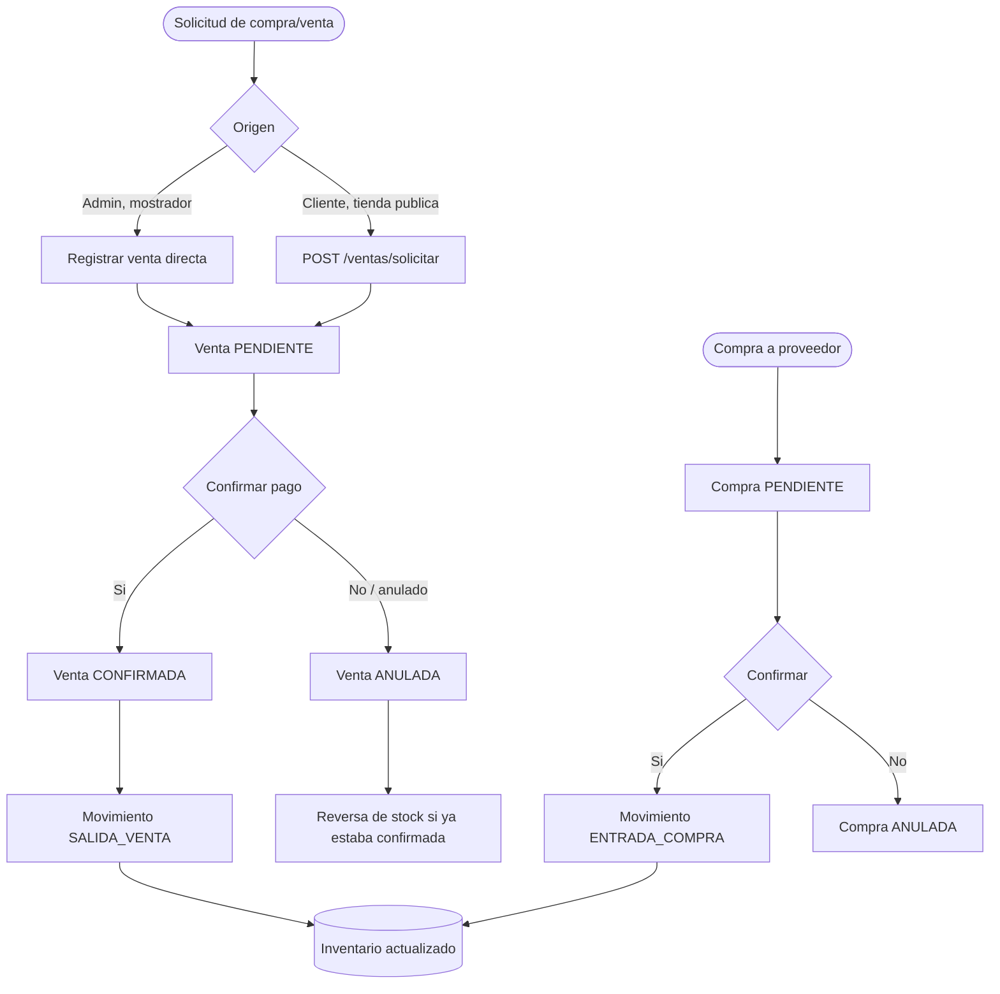
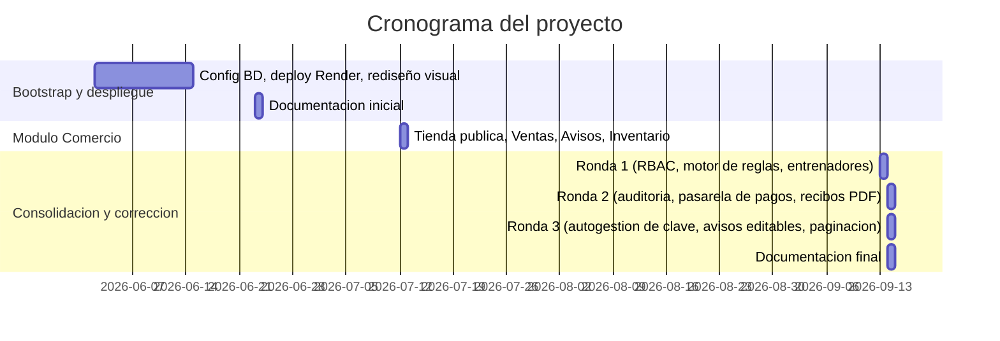
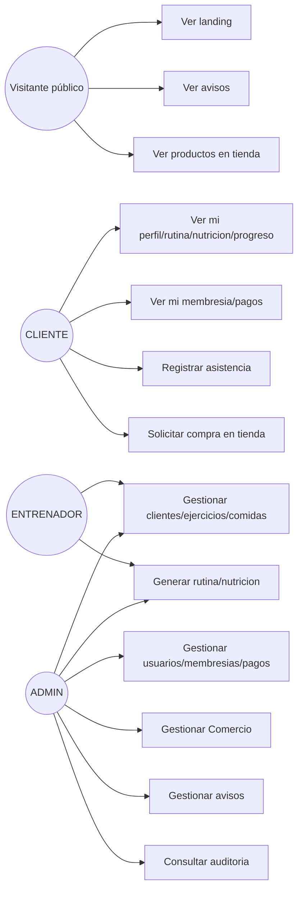
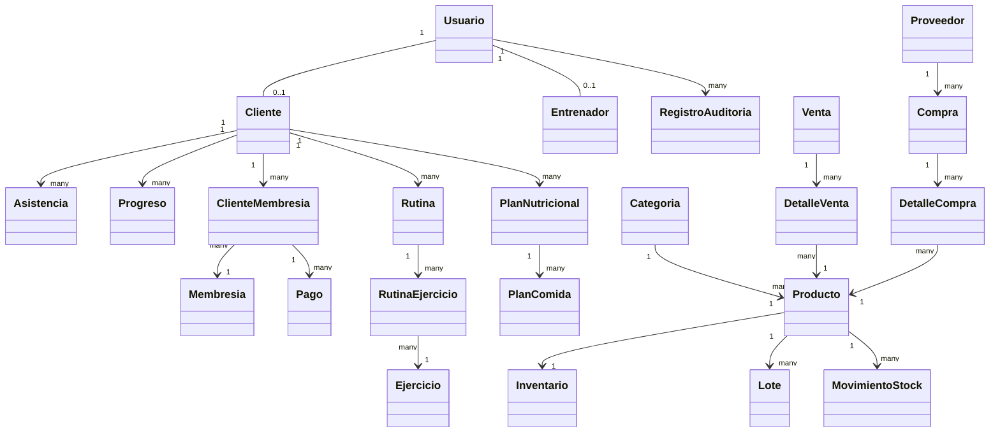
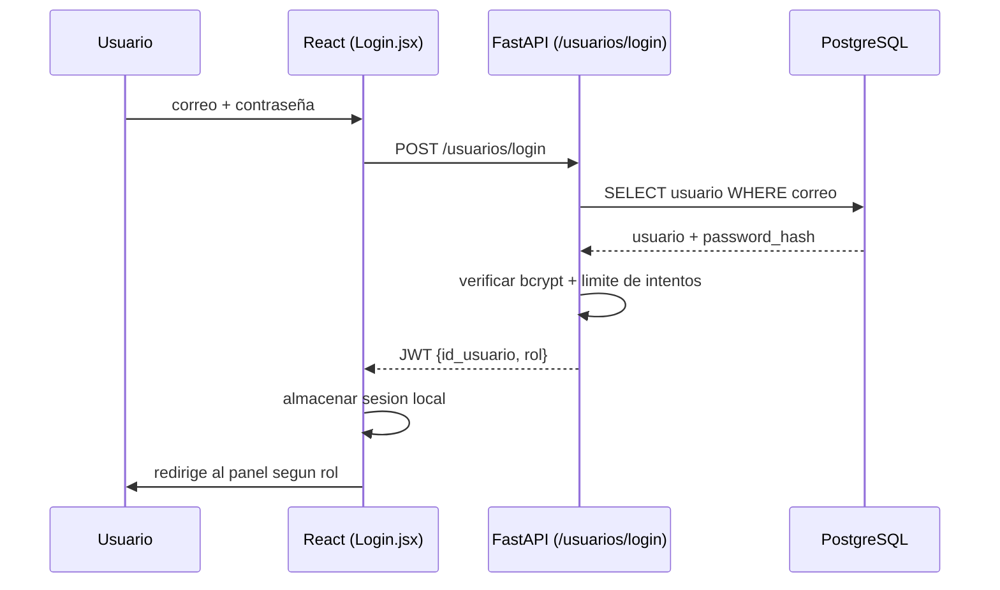
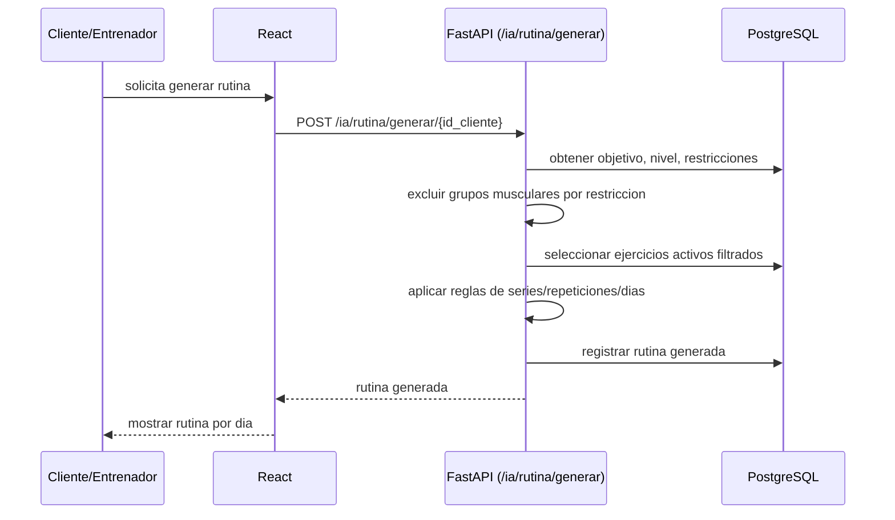

# Intervención Metodológica

# SistemaGimnasioGleyforGym

> La información de este capítulo se obtuvo mediante verificación directa del código fuente del sistema (`backend/`, `web-admin/`) y de su historial de control de versiones, en lugar de inferirse de documentación previa del proyecto. El alcance cubre el sistema web (backend FastAPI + panel de administración React); la aplicación móvil complementaria (Flutter) queda fuera del alcance formal de este documento.

---

## 1. Comprensión del negocio

### 1.1. Definición del problema

GLEYFORGYM es un gimnasio cuyos procesos administrativos y deportivos se gestionaban de forma manual y dispersa: fichas de socios en papel u hojas de cálculo, cobro de membresías sin trazabilidad, y rutinas y planes nutricionales elaborados a mano por cada entrenador sin un criterio sistemático. Esta situación generaba pérdida de información histórica, dificultad para dar seguimiento al progreso físico de los socios, y tiempos de respuesta altos para tareas repetitivas como la generación de rutinas de entrenamiento.

El proyecto responde a esta problemática con una plataforma web que centraliza: control de acceso por rol, ficha biométrica del socio, venta y control de membresías, registro de asistencia física, seguimiento de progreso corporal, y generación asistida de rutinas y planes nutricionales mediante un motor de recomendación. Durante el levantamiento de requisitos se identificó además una ampliación de alcance ya implementada en el sistema: una tienda de productos del gimnasio (suplementos y merchandising) con control de inventario, categorías, proveedores y compras.

El negocio del gimnasio no está sujeto a ninguna normativa ISO obligatoria por tratarse de un servicio no regulado. Las referencias a estándares en el proyecto corresponden a calidad de software, no a normativa de negocio: los requerimientos no funcionales se alinean al modelo de calidad ISO/IEC 25010 (ver sección 3.1).

#### 1.1.1. Identificación de procesos (macroprocesos y procedimientos)

| ID | Proceso | Actor principal | Estado |
|---|---|---|---|
| P01 | Autenticación y control de roles (JWT, RBAC) | Todos los usuarios | Implementado |
| P02 | Gestión de fichas de clientes | Administrador / Entrenador | Implementado |
| P03 | Ventas, pagos y membresías | Administrador | Implementado |
| P04 | Registro de asistencia diaria | Cliente / Administrador / Entrenador | Implementado |
| P05 | Prescripción y gestión de ejercicios | Entrenador / Administrador | Implementado |
| P06 | Generación de rutinas (motor de recomendación) | Motor de reglas / Entrenador | Implementado |
| P07 | Generación de nutrición (motor de recomendación) | Motor de reglas / Entrenador | Implementado |
| P08 | Control de progreso físico | Cliente / Entrenador | Implementado |
| P09 | Gestión comercial: categorías, productos, proveedores, compras, inventario, ventas | Administrador | Implementado |
| P10 | Avisos y comunicados públicos | Administrador | Implementado |
| P11 | Auditoría y trazabilidad de operaciones críticas | Administrador (vía API) | Implementado |
| P12 | Gestión de entrenadores como entidad de negocio | Administrador (vía API) | Implementado |

El levantamiento de requisitos sobre el código real identificó cuatro procesos (P09–P12) que ya operan en producción pero que no estaban documentados formalmente en las primeras versiones del análisis de requisitos del proyecto; esta intervención los incorpora con sus respectivos requerimientos funcionales (sección 3.1).

#### 1.1.2. Diagrama de procesos

Flujo general de autenticación y acceso por rol (P01–P08):

```mermaid
graph TD
    A([Inicio]) --> B[Usuario solicita acceso]
    B --> C{Posee credenciales validas?}
    C -- No --> D[Error de autenticacion] --> B
    C -- Si --> E[JWT + Rol]
    E --> F{Rol}
    F -- ADMIN --> G1[Dashboard General] --> G2[Clientes/Usuarios] & G3[Membresias] & G4[Pagos]
    F -- ENTRENADOR --> H1[Gestion Deportiva] --> H2[Ejercicios/Comidas] & H3[Rutinas/Nutricion] & H4[Fichas de clientes]
    F -- CLIENTE --> I1[Perfil de Socio] --> I2[Membresia/Pagos] & I3[Rutina/Dieta] & I4[Progreso diario]
    G2 & G3 & G4 & H2 & H3 & H4 & I2 & I3 & I4 --> J[(PostgreSQL)]
```

Proceso P09 — gestión comercial:

```mermaid
graph TD
    A([Solicitud de compra/venta]) --> B{Origen}
    B -- Admin, mostrador --> C[Registrar venta directa]
    B -- Cliente, tienda publica --> D[POST /ventas/solicitar]
    C --> E[Venta PENDIENTE]
    D --> E
    E --> F{Confirmar pago}
    F -- Si --> G[Venta CONFIRMADA] --> H[Movimiento SALIDA_VENTA] --> I[(Inventario actualizado)]
    F -- No / anulado --> J[Venta ANULADA] --> K[Reversa de stock si ya estaba confirmada]
    L([Compra a proveedor]) --> M[Compra PENDIENTE] --> N{Confirmar}
    N -- Si --> O[Movimiento ENTRADA_COMPRA] --> I
    N -- No --> P[Compra ANULADA]
```

Los procesos P10–P12 son operaciones CRUD de menor complejidad, protegidas por rol, descritas en detalle en `docs/04_Arquitectura/Arquitectura_Backend.md`.

### 1.2. Identificación de actores

**Actores de negocio (sistema en operación):**
- **ADMIN**: administrador del gimnasio, con acceso completo al sistema.
- **ENTRENADOR**: staff deportivo, gestiona clientes, rutinas y nutrición.
- **CLIENTE**: socio del gimnasio, con acceso a su propia información.
- **Visitante público** (sin autenticarse): consulta la página de inicio, avisos y el catálogo de la tienda.

**Matriz RACI de procesos de negocio** (R = Responsable, A = Aprobador, C = Consultado, I = Informado):

| Proceso | ADMIN | ENTRENADOR | CLIENTE |
|---|---|---|---|
| Autenticación y control de roles (P01) | A | I | I |
| Gestión de fichas de clientes (P02) | A | R | C |
| Ventas, pagos y membresías (P03) | R | C | I |
| Registro de asistencia (P04) | A | R | R |
| Gestión de ejercicios (P05) | A | R | I |
| Generación de rutinas (P06) | A | R | C |
| Generación de nutrición (P07) | A | R | C |
| Control de progreso físico (P08) | I | C | R |
| Gestión comercial (P09) | R | I | C |
| Avisos y comunicados (P10) | R | I | I |
| Auditoría y trazabilidad (P11) | R | I | I |
| Gestión de entrenadores (P12) | R | I | I |

**Equipo de desarrollo del proyecto:**
- Keen Guerra Lozano
- Yago Imanol Espinoza Tiza
- Elizabeth Antonela Inciso Aguilar

**Matriz RACI del equipo de desarrollo:**

| Actividad | Keen Guerra Lozano | Yago Espinoza Tiza | Elizabeth Inciso Aguilar |
|---|---|---|---|
| Definición del problema y alcance | C | R | A |
| Levantamiento de requisitos (RF/RNF) | C | R | A |
| Diseño de base de datos y arquitectura | R | C | C |
| Desarrollo backend (FastAPI) | R | C | I |
| Desarrollo frontend (React) | R | C | I |
| Motor de recomendación (rutinas/nutrición) | R | C | I |
| Diseño y ejecución de pruebas | C | C | R |
| Documentación técnica | C | R | A |
| Despliegue (Render) | R | I | I |
| Control de calidad / revisión final | C | C | A |

### 1.3. Definición del modelo de recomendación

El motor de generación de rutinas y planes nutricionales de GLEYFORGYM **no es un modelo de machine learning entrenado**, sino un **sistema basado en reglas, determinístico**, implementado en `backend/app/ia/rutina/` y `backend/app/ia/nutricion/`. Esta es una decisión de arquitectura explícita del proyecto (DA-009, `docs/07_Gestion_Proyecto/Decisiones_Arquitectura.md`), justificada por tres razones:

1. **Trazabilidad y seguridad clínica**: las restricciones médicas del cliente deben excluir determinísticamente ciertos grupos musculares (ej. una lesión de rodilla excluye ejercicios de pierna). Un modelo probabilístico introduciría el riesgo de recomendar, aunque sea ocasionalmente, un ejercicio contraindicado — inaceptable en un contexto de seguridad física.
2. **Volumen de datos insuficiente para entrenamiento supervisado confiable**: el sistema es de reciente despliegue y no cuenta todavía con el historial de uso necesario para entrenar y validar un modelo con métricas estadísticamente significativas (ver limitación detallada más abajo).
3. **Auditabilidad**: cada recomendación puede explicarse exactamente por la regla que la generó, lo cual es relevante tanto para la confianza del entrenador en la herramienta como para la propia evaluación académica del sistema.

**Variables de entrada:**
- Motor de rutinas: objetivo, nivel físico y restricciones médicas del cliente.
- Motor de nutrición: peso, estatura, edad (derivada de la fecha de nacimiento), sexo, nivel de actividad física, objetivo y restricciones médicas.

**Algoritmo — rutinas:** reglas que mapean objetivo → series/repeticiones/descanso, y nivel → días de entrenamiento por semana; un diccionario de exclusión (`RESTRICCION_GRUPOS_EXCLUIDOS`) descarta grupos musculares según la restricción médica declarada. La selección final de ejercicios dentro de cada grupo permitido se realiza aleatoriamente entre los que cumplen los filtros de estado activo y nivel apto.

**Algoritmo — nutrición:** fórmula de Mifflin-St Jeor (`TMB = 10·peso + 6.25·estatura_cm − 5·edad + constante_sexo`, `GET = TMB × multiplicador_de_actividad`), con ajuste calórico según objetivo (déficit de 500 kcal o superávit de 350 kcal) y reparto de macronutrientes (proteína 1.8 g/kg de peso, grasa 25% de las calorías totales, el resto en carbohidratos). Las comidas concretas se seleccionan por cercanía al presupuesto calórico de cada franja horaria, filtradas por objetivo y estado activo.

**Limitación identificada:** las restricciones médicas se almacenan en el plan nutricional como referencia informativa, pero actualmente no filtran el catálogo de comidas — a diferencia del motor de rutinas, que sí las aplica como filtro activo. Esta es una oportunidad de mejora concreta para una futura iteración del sistema.

**Evaluación de factibilidad de un modelo predictivo complementario:** se evaluó la posibilidad de incorporar, además del motor de reglas, un modelo de aprendizaje supervisado para predecir la no renovación de membresías (*churn*), usando como variables de entrada la frecuencia de asistencia, los días desde la última visita, los pagos atrasados, el tipo de membresía, el objetivo y la edad del socio, comparando algoritmos como Regresión Logística, Random Forest y XGBoost mediante F1-score, AUC-ROC y matriz de confusión. Esta línea de trabajo queda documentada como una extensión futura del proyecto (ver `docs/07_Gestion_Proyecto/Pendientes.md`) y no se implementa en la presente versión, dado que el volumen de datos históricos reales disponible en producción aún no es suficiente para entrenar y validar un modelo cuyas métricas sean estadísticamente representativas — reportar cifras de un modelo entrenado sobre una muestra insuficiente produciría resultados poco confiables, lo cual se considera contrario al criterio de rigor que exige este documento.

---

## 2. Planificación del proyecto

### 2.1. Plan de trabajo

El cronograma siguiente se reconstruyó a partir del historial de control de versiones del repositorio, que inicia el 2 de junio de 2026. Las versiones tempranas del proyecto (v1.0.0 a v2.1.0, entre enero y mayo de 2026) corresponden a una etapa de desarrollo previa a la consolidación de este repositorio.

```mermaid
gantt
    dateFormat YYYY-MM-DD
    title Cronograma del proyecto
    section Bootstrap y despliegue
    Config BD, deploy Render, rediseño visual :2026-06-02, 2026-06-15
    Documentacion inicial :2026-06-23, 1d
    section Modulo Comercio
    Tienda publica, Ventas, Avisos, Inventario :2026-07-12, 2026-07-13
    section Consolidacion y correccion
    Ronda 1 (RBAC, motor de reglas, entrenadores) :2026-09-13, 1d
    Ronda 2 (auditoria, pasarela de pagos, recibos PDF) :2026-09-14, 1d
    Ronda 3 (autogestion de clave, avisos editables, paginacion) :2026-09-14, 1d
    Documentacion final :2026-09-14, 2026-09-15
```

**Recursos del proyecto:**

| Recurso | Uso | Duración |
|---|---|---|
| Equipo de desarrollo (3 integrantes) | Análisis, desarrollo full-stack, documentación, pruebas y despliegue | Todo el proyecto |
| Render (plan gratuito) | Hosting del backend, frontend y base de datos PostgreSQL | Desde el despliegue inicial |
| Cloudinary (plan gratuito) | CDN de videos e imágenes | Desde la integración del módulo de ejercicios |
| SonarQube (instancia local) | Análisis estático de calidad de código | Continuo durante el desarrollo |

El proyecto no incurrió en gastos económicos directos, ya que todos los servicios externos utilizados operan en su plan gratuito.

### 2.2. Modelo de ciclo de vida

Se adoptó un **ciclo de vida iterativo-incremental**, organizado en fases funcionales agrupadas en rondas de revisión sucesivas, cada una entregando una porción del sistema verificable e independientemente desplegable. Este enfoque se asemeja a un modelo Kanban informal por fases más que a Scrum formal (no se emplearon sprints ni ceremonias de gestión ágil estandarizadas) o a cascada (no hay etapas rígidamente secuenciales ni congeladas).

Etapas internas de cada fase:
1. Identificación de la brecha o funcionalidad a resolver, mediante revisión del código existente.
2. Implementación de la corrección o funcionalidad.
3. Documentación del cambio cuando corresponde.

### 2.3. Definición de roles del equipo

| Rol | Responsable |
|---|---|
| Analista de requisitos | Yago Espinoza Tiza |
| Arquitecto / Desarrollador full-stack | Keen Guerra Lozano |
| Tester / QA | Elizabeth Inciso Aguilar |
| Documentación técnica | Yago Espinoza Tiza, Elizabeth Inciso Aguilar |
| DevOps (despliegue en Render) | Keen Guerra Lozano |

### 2.4. Herramientas de gestión

El equipo, de tamaño reducido, no empleó herramientas formales de gestión de proyectos (JIRA, Trello, MS Project); la coordinación de tareas se realizó mediante mensajes de commit estructurados por fase, que cumplieron la función de un backlog informal.

| Categoría | Herramienta |
|---|---|
| Lenguaje de programación (backend) | Python 3.12 |
| Lenguaje de programación (frontend) | JavaScript (JSX) |
| Framework backend | FastAPI 0.136 + SQLAlchemy 2.0 + Pydantic 2.13 |
| Framework frontend | React 19 + Vite 8 + React Router DOM 7 + Axios 1.15 + Recharts 3.8 |
| Gestor de base de datos | PostgreSQL |
| IDE de desarrollo | Visual Studio Code |
| Prototipos y mockups | Imágenes estáticas (`docs/09_mockups/`) |
| Modelado de sistema | Diagramas Mermaid (este documento) |
| Testing backend | pytest, pytest-cov |
| Testing frontend | Vitest, @testing-library/react, @vitest/coverage-v8 |
| Calidad de código | SonarQube (instancia local) |
| Control de versiones | Git + GitHub |

### 2.5. Planificación de pruebas

La estrategia de pruebas se documenta en `docs/05_Desarrollo/Plan_Pruebas.md`, e incluye los módulos de Comercio, Avisos, Auditoría y Entrenadores. Se aplicaron dos estrategias complementarias: pruebas basadas en requisitos (trazabilidad entre requerimientos funcionales y casos de prueba) y pruebas basadas en riesgo, priorizando los módulos que manejan dinero y stock (Pagos, Compras, Ventas). No se incorporó automatización de pruebas end-to-end (Selenium o Cypress no forman parte del stack del proyecto).

---

## 3. Análisis de requisitos

### 3.1. Requerimientos funcionales y no funcionales

Los requerimientos funcionales y no funcionales completos se documentan en `docs/03_Analisis/Requerimientos_Funcionales.md` y `Requerimientos_No_Funcionales.md`. A continuación se resume su distribución por módulo:

| Módulo | Requerimientos funcionales | Prioridad predominante |
|---|---|---|
| Usuarios y autenticación | RF-001 a RF-015 | Alta |
| Clientes | RF-016 a RF-035 | Alta |
| Membresías | RF-036 a RF-050 | Alta |
| Cliente-Membresías | RF-051 a RF-065 | Alta |
| Pagos | RF-066 a RF-080 | Alta |
| Asistencias | RF-081 a RF-090 | Alta |
| Progreso físico | RF-091 a RF-110 | Media-Alta |
| Ejercicios | RF-111 a RF-125 | Alta |
| Comidas | RF-126 a RF-135 | Alta |
| Rutinas (motor de reglas) | RF-136 a RF-145 | Alta |
| Nutrición (motor de reglas) | RF-146 a RF-155 | Alta |
| Seguridad y control de acceso | RF-156 a RF-165 | Alta |
| Dashboard y reportes | RF-166 a RF-175 | Media |
| Entrenadores, Avisos, Auditoría | RF-176 a RF-190 | Media-Alta |
| Comercio (categorías, productos, proveedores, compras, inventario, ventas) | RF-191 a RF-226 | Media-Alta |

Los requerimientos no funcionales (`RNF-001` a `RNF-030`) se organizan según el modelo de calidad ISO/IEC 25010, en ocho categorías: seguridad, rendimiento, disponibilidad, usabilidad, compatibilidad, mantenibilidad, escalabilidad e integración multimedia.

### 3.2. Historias de usuario y criterios de aceptación

Cada requerimiento funcional se tradujo en una o varias historias de usuario con su correspondiente criterio de aceptación. A continuación se presenta una muestra representativa por módulo (el detalle completo de los 226 requerimientos funcionales se encuentra en `Requerimientos_Funcionales.md`):

| ID | Historia de usuario | Criterio de aceptación |
|---|---|---|
| HU-01 | Como administrador, quiero iniciar sesión con correo y contraseña para acceder al panel según mi rol. | El sistema genera un token JWT válido y redirige al panel correspondiente al rol (ADMIN/ENTRENADOR/CLIENTE). |
| HU-02 | Como administrador, quiero registrar un cliente con su ficha biométrica para llevar su historial deportivo. | El cliente queda registrado con DNI único, vinculado a un usuario con rol CLIENTE. |
| HU-03 | Como administrador, quiero asignar una membresía a un cliente para formalizar su suscripción. | La fecha de fin se calcula automáticamente y el precio vigente queda congelado en el registro de la asignación. |
| HU-04 | Como cliente, quiero registrar mi asistencia al ingresar al gimnasio para llevar un historial de mi concurrencia. | La asistencia queda asociada al cliente con fecha y hora de ingreso. |
| HU-05 | Como entrenador, quiero generar una rutina para un cliente para ahorrar tiempo de planificación manual. | La rutina generada excluye ejercicios de grupos musculares contraindicados por la restricción médica del cliente. |
| HU-06 | Como entrenador, quiero generar un plan nutricional para un cliente según su perfil. | El plan calcula las calorías de mantenimiento mediante la fórmula de Mifflin-St Jeor y distribuye las comidas por franja horaria. |
| HU-07 | Como cliente, quiero visualizar mi progreso físico histórico para evaluar mi evolución. | El cliente visualiza únicamente sus propios registros, ordenados cronológicamente. |
| HU-08 | Como administrador, quiero registrar una venta de productos para controlar los ingresos de la tienda. | El stock del producto se descuenta automáticamente al confirmar la venta. |
| HU-09 | Como visitante, quiero consultar los avisos del gimnasio sin necesidad de iniciar sesión. | Solo se muestran los avisos en estado activo a los visitantes no autenticados. |
| HU-10 | Como administrador, quiero consultar el historial de auditoría de operaciones críticas para dar trazabilidad al sistema. | Cada operación crítica (ej. anulación de un pago) genera un registro con usuario, entidad y fecha. |

### 3.3. Priorización de requerimientos

La priorización se realizó mediante la técnica **MoSCoW**, aplicada sobre los módulos del sistema:

| Categoría | Módulos / funcionalidades |
|---|---|
| **Must have** (imprescindible) | Autenticación y roles, gestión de clientes, membresías, pagos, asistencias |
| **Should have** (debería tener) | Motor de rutinas y nutrición, seguimiento de progreso físico, dashboard de KPIs |
| **Could have** (podría tener) | Avisos editables, exportación CSV/PDF, paginación de listados, módulo de Comercio |
| **Won't have** (esta versión) | Pasarela de pago real, envío de correo real, verificación de correo al registro, contenerización Docker, integración continua, modelo predictivo de no renovación |

### 3.4. Product backlog

El backlog, reconstruido en orden real de implementación:

1. Configuración de base de datos, modelos iniciales y operaciones CRUD de clientes, membresías y ejercicios.
2. Autenticación: login, JWT, cifrado de contraseñas, roles.
3. Motor de recomendación (rutinas y nutrición), integración con Cloudinary.
4. Rediseño visual de la interfaz, despliegue en Render, migración a PostgreSQL en producción.
5. Módulo de Comercio completo (categorías, productos, proveedores, compras, inventario, ventas, tienda pública) y módulo de Avisos.
6. Primera ronda de consolidación: control de acceso por roles completo, motor de recomendación con restricciones médicas, entidad de entrenadores, indicadores del panel, limitación de intentos de acceso.
7. Segunda ronda de consolidación: auditoría y trazabilidad, arquitectura de pasarela de pagos, recuperación de contraseña, recibos en PDF.
8. Tercera ronda de consolidación: autogestión de contraseñas, avisos editables desde el panel, indicador de asistencias, paginación de listados.
9. Actualización de la documentación de requisitos, casos de prueba y arquitectura para reflejar los módulos de Comercio, Avisos, Auditoría y Entrenadores.

---

## 4. Diseño y modelado del sistema

### 4.1. Arquitectura del software

La arquitectura general se organiza en capas (presentación → servicios FastAPI → lógica de negocio → datos PostgreSQL → servicios externos), documentada en `docs/04_Arquitectura/Arquitectura_General.md`. El backend expone 21 routers agrupados por módulo, más un submódulo de inteligencia artificial (`app/ia/`) y módulos de soporte transversales: `pagos_gateway/` (abstracción de pasarela de pago mediante el patrón *strategy*), `rate_limit.py` (limitador de intentos de inicio de sesión), `recibos.py` (generación de comprobantes en PDF) y `auditoria.py` (registro de trazabilidad).

El framework backend enruta por módulo (`app/routes/*.py`) sin capas MVC explícitas: la validación de datos reside en `schemas.py` (Pydantic), la persistencia en `models.py` (SQLAlchemy), y la lógica de negocio dentro de cada router o en `app/ia/`.

### 4.2. Diseño de base de datos

**Modelo conceptual.** El dominio se organiza en dos bloques relacionados: el bloque de gestión deportiva (usuarios → clientes → {asistencias, progreso, membresías, rutinas, nutrición}) y el bloque comercial (productos ↔ inventario ↔ lotes ↔ movimientos de stock ↔ {compras, ventas}), ambos documentados en `docs/04_Arquitectura/Arquitectura_BaseDatos.md`.

**Primera forma normal (1FN).** Se eliminaron los grupos repetitivos: las medidas corporales del progreso físico se almacenan en columnas atómicas independientes (brazo izquierdo, brazo derecho, pierna izquierda, pierna derecha, pecho, cintura) en lugar de una lista o campo compuesto, decisión documentada como DA-013.

**Modelo lógico.** El esquema físico implementado comprende 26 tablas en PostgreSQL, con sus tipos de datos y restricciones definidos mediante SQLAlchemy, documentadas campo por campo en `Arquitectura_BaseDatos.md`.

**Segunda forma normal (2FN) y relaciones N:M.** Las relaciones muchos-a-muchos se resuelven mediante tablas intermedias: `cliente_membresias` (entre clientes y membresías, con la fecha de asignación y el precio vigente al momento de la asignación), y `detalle_compras`/`detalle_ventas` (entre compras/ventas y productos, con cantidad y precio unitario). No existen dependencias parciales sobre claves compuestas.

**Modelo físico (3FN) y excepción intencional.** El esquema se encuentra en tercera forma normal, con una única excepción deliberada: el campo `precio_asignado` en `cliente_membresias` almacena una copia del precio de la membresía al momento de la asignación (decisión DA-010), para que cambios posteriores en el precio del plan no alteren retroactivamente el monto ya contratado por un socio. Esta desnormalización es intencional y documentada, no un error de diseño.

### 4.3. Modelado del sistema (UML)

#### 4.3.1. Diagrama de casos de uso

```mermaid
graph LR
    Publico((Visitante público))
    Cliente((CLIENTE))
    Entrenador((ENTRENADOR))
    Admin((ADMIN))

    Publico --> UC1[Ver landing]
    Publico --> UC2[Ver avisos]
    Publico --> UC3[Ver productos en tienda]

    Cliente --> UC4[Ver mi perfil/rutina/nutricion/progreso]
    Cliente --> UC5[Ver mi membresia/pagos]
    Cliente --> UC6[Registrar asistencia]
    Cliente --> UC7[Solicitar compra en tienda]

    Entrenador --> UC8[Gestionar clientes/ejercicios/comidas]
    Entrenador --> UC9[Generar rutina/nutricion]

    Admin --> UC10[Gestionar usuarios/membresias/pagos]
    Admin --> UC11[Gestionar Comercio]
    Admin --> UC12[Gestionar avisos]
    Admin --> UC13[Consultar auditoria]
    Admin --> UC8
    Admin --> UC9
```

#### 4.3.2. Diagrama de clases (modelo de datos)

```mermaid
classDiagram
    Usuario "1" -- "0..1" Cliente
    Usuario "1" -- "0..1" Entrenador
    Cliente "1" --> "many" Asistencia
    Cliente "1" --> "many" Progreso
    Cliente "1" --> "many" ClienteMembresia
    ClienteMembresia "many" --> "1" Membresia
    ClienteMembresia "1" --> "many" Pago
    Cliente "1" --> "many" Rutina
    Rutina "1" --> "many" RutinaEjercicio
    RutinaEjercicio "many" --> "1" Ejercicio
    Cliente "1" --> "many" PlanNutricional
    PlanNutricional "1" --> "many" PlanComida
    Categoria "1" --> "many" Producto
    Producto "1" --> "1" Inventario
    Producto "1" --> "many" Lote
    Producto "1" --> "many" MovimientoStock
    Proveedor "1" --> "many" Compra
    Compra "1" --> "many" DetalleCompra
    DetalleCompra "many" --> "1" Producto
    Venta "1" --> "many" DetalleVenta
    DetalleVenta "many" --> "1" Producto
    Usuario "1" --> "many" RegistroAuditoria
```

#### 4.3.3. Diagrama de secuencia — inicio de sesión

```mermaid
sequenceDiagram
    participant U as Usuario
    participant F as React (Login.jsx)
    participant A as FastAPI (/usuarios/login)
    participant DB as PostgreSQL
    U->>F: correo + contraseña
    F->>A: POST /usuarios/login
    A->>DB: SELECT usuario WHERE correo
    DB-->>A: usuario + password_hash
    A->>A: verificar bcrypt + limite de intentos
    A-->>F: JWT {id_usuario, rol}
    F->>F: almacenar sesion local
    F->>U: redirige al panel segun rol
```

#### 4.3.4. Diagrama de secuencia — generación de rutina

```mermaid
sequenceDiagram
    participant C as Cliente/Entrenador
    participant F as React
    participant A as FastAPI (/ia/rutina/generar)
    participant DB as PostgreSQL
    C->>F: solicita generar rutina
    F->>A: POST /ia/rutina/generar/{id_cliente}
    A->>DB: obtener objetivo, nivel, restricciones
    A->>A: excluir grupos musculares por restriccion
    A->>DB: seleccionar ejercicios activos filtrados
    A->>A: aplicar reglas de series/repeticiones/dias
    A->>DB: registrar rutina generada
    A-->>F: rutina generada
    F-->>C: mostrar rutina por dia
```

### 4.4. Modelado de interfaces (prototipos)

Se diseñaron tres mockups en estilo visual "Dark Luxury Glassmorphic" (`docs/09_mockups/`): el panel administrativo web, que corresponde directamente al dashboard implementado en el sistema; y dos mockups de la aplicación móvil complementaria (rutinas y nutrición), que ilustran el ecosistema completo del producto aunque no forman parte del alcance evaluado de este documento.

---

## 5. Desarrollo y codificación del sistema

### 5.1. Implementación de funcionalidades

La implementación siguió el backlog retrospectivo descrito en la sección 3.4 y el cronograma de la sección 2.1, organizados por fases funcionales agrupadas en rondas de consolidación sucesivas.

### 5.2. Control de versiones

El flujo de trabajo recomendado para el proyecto (`docs/05_Desarrollo/Flujo_Git.md`) define una estrategia de ramas `main`/`develop`/`feature-*` con *Conventional Commits*. En la práctica, el desarrollo se realizó mediante commits directos agrupados por fase funcional, documentados con mensajes descriptivos del tipo `"Fase 2 (backend): motor de recomendación - restricciones médicas, nivel y calorías"` o `"Fase 1 (3ra revisión): autogestión de contraseñas"`, que cumplieron la función de hitos de entrega verificables.

### 5.3. Buenas prácticas de programación

El proyecto sigue las convenciones documentadas en `docs/05_Desarrollo/Convenciones_Codigo.md`: nomenclatura `snake_case` en el backend (Python), `PascalCase` para componentes y clases, y `camelCase` en JavaScript. Se aplica además el patrón de borrado lógico (columna `estado`) en lugar de eliminación física de registros en la mayoría de las entidades, para preservar el historial de operaciones del gimnasio.

---

## 6. Desarrollo de pruebas

### 6.1. Diseño de casos de prueba

El backend cuenta con 48 funciones de prueba en `backend/tests/test_backend.py` y 7 en `test_crud.py`, ejecutadas sobre un cliente de pruebas de FastAPI con base de datos SQLite aislada. El frontend cuenta con 33 archivos de prueba (`*.test.jsx`/`*.test.js`) basados en Vitest y Testing Library, que simulan las llamadas a la API y verifican el comportamiento de la interfaz. La trazabilidad entre requerimientos y casos de prueba se documenta en `docs/05_Desarrollo/Casos_Prueba.md` (CP-001 a CP-073).

#### 6.1.1. Casos de prueba de verificación (análisis estático)

La verificación del software, previa a su ejecución, se realizó mediante **SonarQube** (instancia local) configurado sobre los tres componentes del proyecto (`sonar-project.properties`), analizando duplicación de código, complejidad ciclomática, code smells y vulnerabilidades potenciales según el conjunto de reglas estándar de la herramienta. El servidor de análisis no se mantiene activo de forma permanente, por lo que este documento no reporta cifras puntuales de ese análisis para evitar citar datos que no sean reproducibles al momento de la lectura; se recomienda ejecutar `sonar-scanner` antes de la entrega final del proyecto si se requiere incluir el reporte completo de calidad estática.

#### 6.1.2. Casos de prueba de validación (análisis dinámico)

La validación del software en ejecución se realizó mediante las suites de pruebas automatizadas (pytest y Vitest), cuyos resultados se presentan en la sección 6.2, combinando pruebas de caja negra (verificación de funcionalidad frente a los requerimientos, ej. CP-001 Login), pruebas de caja blanca (cobertura de línea mediante `pytest-cov` y `@vitest/coverage-v8`) y pruebas exploratorias manuales realizadas durante las rondas de consolidación del proyecto.

### 6.2. Resultados de pruebas

| Suite | Resultado |
|---|---|
| Backend (`pytest --cov`) | 55 pruebas aprobadas, cobertura total de 81% (3113 sentencias) |
| Frontend (`vitest run --coverage`) | 143 pruebas aprobadas en 33 archivos, cobertura total de 78.21% de sentencias |

Los módulos centrales del sistema (usuarios, clientes, membresías, pagos, motor de recomendación, avisos, auditoría) presentan una cobertura de backend entre 87% y 100%. El módulo de Comercio, en cambio, no cuenta con funciones de prueba dedicadas: `categorias.py` 37%, `proveedores.py` 43%, `inventario.py` 26%, `productos.py` 23%, `compras.py` 20%, `ventas.py` 17% — estos porcentajes provienen únicamente de la ejecución del registro de rutas al iniciar la aplicación, no de pruebas que ejerciten su lógica de negocio. En el frontend, las páginas de Comercio presentan un patrón equivalente, entre 1.3% y 2.8% de cobertura. Esta brecha de cobertura está documentada como prioridad alta de mejora continua en `docs/07_Gestion_Proyecto/Pendientes.md` (P-04).

### 6.3. Automatización de pruebas

Las pruebas se automatizaron con pytest-cov (backend) y Vitest con @vitest/coverage-v8 (frontend), ejecutadas manualmente por el equipo de desarrollo. El proyecto no cuenta con integración continua (no existe configuración de GitHub Actions), por lo que la ejecución de las suites no está automatizada ante cada cambio en el repositorio — una oportunidad de mejora documentada en `Pendientes.md` (P-09). No se emplearon herramientas de automatización end-to-end como Selenium o Cypress.

---

## 7. Implementación o despliegue

### 7.1. Configuración de entorno de despliegue

El despliegue en producción se automatiza mediante un plano `render.yaml`, que define tres servicios en la plataforma Render:

- **Servicio web** `gleyforgym-backend` (FastAPI): instala las dependencias de `requirements.txt` e inicia con `uvicorn`. Variables de entorno: cadena de conexión a la base de datos (enlazada automáticamente), clave secreta (generada automáticamente), algoritmo de cifrado, tiempo de expiración del token, credenciales de Cloudinary y orígenes permitidos para CORS.
- **Sitio estático** `gleyforgym-frontend` (React/Vite): se compila con `npm run build` y se sirve con reescritura de rutas para soportar el enrutado de una aplicación de página única.
- **Base de datos administrada** `gleyforgym-db` (PostgreSQL, plan gratuito).

El proyecto no incluye contenerización (no existen archivos `Dockerfile` ni `docker-compose.yml`); el despliegue depende de los sistemas de construcción nativos de la plataforma Render.

### 7.2. Validación de funcionamiento en producción

Se verificó el funcionamiento en vivo de ambos servicios de producción:

| Servicio | URL | Resultado |
|---|---|---|
| Backend (documentación interactiva) | `https://gleyforgym-backend.onrender.com/docs` | Respuesta HTTP 503 en el primer intento (servicio inactivo por falta de uso reciente); HTTP 200 al reintentar aproximadamente 17 segundos después, con la documentación interactiva de la API cargando correctamente |
| Frontend | `https://gleyforgym-frontend.onrender.com` | Respuesta HTTP 200 inmediata |

El comportamiento observado en el backend corresponde al *cold start* característico del plan gratuito de Render: el servicio se suspende tras un período de inactividad y tarda unos segundos en reactivarse ante la primera solicitud. Este comportamiento, documentado como riesgo operativo en `Pendientes.md` (P-16), queda confirmado empíricamente mediante esta prueba.

---

## 8. Monitoreo del sistema — motor de recomendación basado en reglas

Esta sección se reformula respecto al enfoque de machine learning tradicional (comprensión de datos, entrenamiento 80/20, métricas de clasificación), dado que el motor de recomendación del sistema es determinístico y no un modelo entrenado (ver justificación en la sección 1.3). En su lugar, se documenta la validación real aplicada al componente de recomendación del sistema.

### 8.1. Comprensión de los datos del motor

Las fuentes de datos del motor de recomendación son el perfil biométrico y de objetivo del cliente, el catálogo de ejercicios y el catálogo de comidas, ambos filtrados por estado activo. No existe ingesta de datos externa ni un conjunto de datos histórico de entrenamiento, ya que el motor no requiere una fase de aprendizaje.

### 8.2. Filtros aplicados

- **Rutinas**: exclusión de grupos musculares por restricción médica, filtro por nivel apto del ejercicio, filtro por estado activo.
- **Nutrición**: filtro de comidas por objetivo (o categoría general) y estado activo; selección de la comida cuya caloría real esté más cercana al presupuesto calórico de cada franja horaria.

### 8.3. Algoritmo de recomendación

Heurísticas condicionales para la selección de ejercicios (sección 1.3), y la fórmula de Mifflin-St Jeor para el cálculo nutricional. No existe entrenamiento ni ajuste de parámetros por aprendizaje automático: los parámetros del motor son constantes de negocio (multiplicadores de actividad física, proporciones de macronutrientes, series y repeticiones por objetivo) ajustables manualmente por el equipo.

### 8.4. Validación del motor de recomendación

Al no existir una tarea de clasificación o predicción supervisada, no se reportan métricas como *accuracy*, F1-score o matriz de confusión. La validación aplicada en el proyecto es **cualitativa y basada en revisión humana**: los entrenadores del gimnasio evaluaron una muestra de 100 rutinas generadas por el sistema, verificando la coherencia metodológica de la recomendación y la ausencia de ejercicios contraindicados dado el perfil médico de cada cliente (por ejemplo, que un cliente con lesión de rodilla no reciba ejercicios de sentadilla con carga). Esta evaluación constituye la métrica de éxito real y verificable del componente de recomendación del sistema.

### 8.5. Despliegue e interpretación

El motor de recomendación está integrado en producción a través de los endpoints `POST /ia/rutina/generar/{id_cliente}` y `POST /ia/nutricion/generar/{id_cliente}`. El panel administrativo consolida en tiempo real cuántas rutinas y planes nutricionales fueron generados por el motor frente a los creados manualmente por un entrenador, lo cual constituye un indicador cuantitativo real de adopción de la herramienta por parte del equipo del gimnasio.

**Alcance y limitaciones:** el motor de nutrición registra las restricciones médicas del cliente en el plan generado como referencia informativa, pero actualmente no las utiliza como filtro del catálogo de comidas — a diferencia del motor de rutinas. Se identifica como una mejora concreta para una futura iteración del sistema.

---

## 9. Mantenimiento y mejora continua

### 9.1. Manual de usuario

El comportamiento del sistema por rol, verificado contra las páginas reales del panel administrativo y sus rutas protegidas, es el siguiente:

**Visitante público (sin iniciar sesión)**
- Página de inicio: planes de membresía e información general del gimnasio.
- Avisos: horarios, entrenadores, clases y comunicados vigentes.
- Tienda: catálogo de productos disponibles, solo consulta.

**ADMIN** (acceso completo)
- Panel principal con indicadores: clientes activos, recaudación del mes, rutinas generadas por el motor de recomendación, asistencias del día y del mes.
- Administración: usuarios, clientes, membresías, asignación de membresías, pagos, asistencias, progreso físico.
- Contenido deportivo: ejercicios, comidas, rutinas y planes nutricionales, gestión de avisos.
- Comercio: categorías, productos, proveedores, compras, inventario, ventas.
- Es el único rol habilitado para restablecer directamente la contraseña de otro usuario.

**ENTRENADOR**
- Panel con resumen de clientes asignados.
- Gestión deportiva: clientes, asistencias, progreso, ejercicios, comidas, rutinas y nutrición.
- Sin acceso a usuarios, membresías, pagos ni al módulo de Comercio.

**CLIENTE** (acceso restringido a su propia información)
- Mi perfil: datos personales y deportivos, cambio de contraseña propio.
- Mi rutina, mi nutrición, mi progreso (con registro de nuevas mediciones), mi membresía y mis pagos, con descarga de recibo en PDF.

Se identificó una limitación de usabilidad: los módulos de Entrenadores (como entidad de negocio) y Auditoría existen en el backend con permisos correctamente restringidos al rol ADMIN, pero no cuentan con una página propia en el panel administrativo — solo son accesibles directamente contra la API. Esta mejora queda documentada en `Pendientes.md` (P-18).

### 9.2. Manual de instalación y mantenimiento

El proceso de instalación local y despliegue se documenta en `docs/05_Desarrollo/Guia_Instalacion.md` (instalación local), `docs/05_Desarrollo/Manual_Desarrollador.md` (procedimiento para agregar un nuevo endpoint, pantalla o tabla) y `docs/05_Desarrollo/Guia_Despliegue.md` (despliegue en Render y alternativas de infraestructura).

### 9.3. Escalabilidad y seguridad a largo plazo

El detalle completo de mejoras pendientes, priorizadas y verificadas contra el código, se documenta en `docs/07_Gestion_Proyecto/Pendientes.md` (P-01 a P-18). Se resumen a continuación los puntos más relevantes para la escalabilidad y seguridad del sistema:

- **Prioridad alta**: verificación de correo electrónico al registro (P-01); activación de una pasarela de pago real — la arquitectura ya está preparada mediante una interfaz intercambiable, y actualmente opera en modo de simulación (P-02); envío real de correo electrónico (P-03); ampliación de la cobertura de pruebas del módulo de Comercio (P-04).
- **Prioridad media**: alertas de vencimiento de membresía (P-05); exportación en PDF de rutinas y planes nutricionales, hoy disponible solo para recibos de pago (P-06); integración continua (P-09); distribución del limitador de intentos de inicio de sesión en despliegues con múltiples procesos (P-10); incorporación de páginas de administración para Entrenadores y Auditoría (P-18).
- **Prioridad baja**: migración de la configuración de esquemas Pydantic a su sintaxis más reciente (P-12); contenerización del proyecto (P-13); monitoreo y registro centralizado de errores (P-14); respaldo de base de datos independiente del proveedor de hosting (P-15); mitigación de los riesgos del plan gratuito de Render — tiempo de reactivación del servicio y expiración de la base de datos a los 90 días sin actualización de plan (P-16), confirmado empíricamente en la sección 7.2 de este documento.
